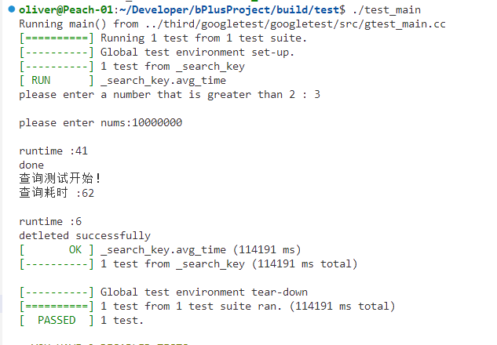

# B+Tree 任务报告

## 1 项目背景

B+树（B+ tree）是一种广泛应用于数据库和文件系统等数据结构的自平衡树结构。它是B树（B-tree）的一种变种，相比于B树，在许多情况下具有更好的性能。

B+树的主要原理如下：

1. 节点结构：
   - B+树由分支节点和叶子节点组成。
   - 分支节点存储键值和指向子树的指针，用于导航到叶子节点。
   - 叶子节点包含键值和实际要求存储的数据
2. 有序性：
   - 所有叶子节点按照键值的顺序连接在一起，形成一个有序链表（带头结点的双向链表）。
   - 这种有序性使得范围查询和范围扫描更加高效。
3. 平衡性：
   - B+树通过分裂和合并节点来保持平衡，确保树的高度相对较小，从而提高检索效率。
   - 当一个节点存储的键值对数量超过了一个阈值时，节点会被分裂成两个节点。
   - 当一个节点存储的键值对数量低于一定阈值时，节点可能会与相邻节点合并。
   - 非叶根节点至少有2个关键字，叶根节点可以有任意的关键字个数
   - M阶B+树，分支节点的关键字个数：（M+1）/ 2 <= N <= M
4. 查找操作：
   - 从根节点开始，通过内部节点的索引信息逐级导航，直到找到叶子节点。（这里也可以用二分查找）
   - 在叶子节点中进行二分查找或线性查找以定位所需的数据。
5. 插入操作：
   - 首先进行查找操作，找到应该插入的叶子节点。
   - 插入键值对，并确保节点不会超过M。如果节点超过M，则需要进行节点分裂操作。
   - 分裂完成后，父节点中的关键字个数可能也会超过M,此时需要继续向上分裂，知道节点中关键字个数合理。
6. 删除操作：
   - 首先进行查找操作，找到要删除的叶子节点。
   - 从叶子节点中删除键值对。如果删除后节点的键值对数量低于一定阈值，可能需要向兄弟节点的借元素，来保证关键字个数，无法借元素则需要进行节点合并操作。
7. 范围查询：
   - 由于叶子节点有序连接，范围查询非常高效。可以从起始叶子节点开始，沿着链表遍历到结束叶子节点。

B+树的主要优点包括高效的范围查询、插入和删除操作的性能稳定性，以及对磁盘存储的友好性。这使得B+树在数据库管理系统和文件系统中得到广泛应用，特别是在需要支持高并发、大容量数据存储和检索的场景中。

意义： B+树中使用局部性原理的主要地方包括：

1. **节点分裂：** 当一个节点达到最大容量时，B+树会执行节点分裂操作，将这个节点分成两个。这个分裂操作通常只涉及到这个节点以及它的父节点，以及可能影响到相邻节点的部分。这符合局部性原理，因为只有与分裂节点相关的数据需要被重新组织。
2. **插入操作：** 在执行插入操作时，B+树会按照有序性原则，找到正确的位置进行插入。这通常涉及到一系列相邻节点的操作，但只有与插入操作相关的节点会被修改，其余节点保持不变。这也是局部性原理的应用。
3. **查找操作：** 当执行查找操作时，B+树会按照内部节点的索引信息逐级导航，直到找到叶子节点。在这个过程中，只有与查找路径相关的节点被访问，而其余节点不会被读取。这减少了不必要的磁盘访问，符合局部性原理。
4. **合并节点：** 当执行删除操作并导致相邻叶子节点的键值对数量低于一定阈值时，B+树可能会执行节点合并操作，将这两个节点合并成一个节点。合并操作通常只涉及到这两个节点以及它们的父节点，符合局部性原理。

总之，B+树通过在节点分裂、插入、查找和合并等操作中最小化涉及的节点数量，充分利用局部性原理，以提高磁盘I/O的效率和整体性能。这种优化有助于减少不必要的磁盘访问和数据迁移，提高了B+树在数据库和文件系统等应用中的性能。

应用场景：

B+树是一种非常常见的数据结构，广泛应用于各种应用场景，特别是需要高效地支持数据插入、删除、搜索和范围查询操作的场合。以下是一些B+树的主要应用场景：

1. **数据库管理系统：** B+树是关系数据库管理系统中常用的索引结构，用于加速数据库表的查找、插入、更新和删除操作。数据库中的索引通常使用B+树来实现。
2. **文件系统：** B+树可以用于文件系统的目录结构，使得文件系统能够高效地查找文件和目录，并支持文件的快速插入和删除。
3. **缓存管理：** 在缓存中管理数据的索引结构时，B+树可以用于快速查找和替换缓存中的数据项，以提高数据访问性能。
4. **键-值存储：** B+树可以用于实现键-值存储引擎，如NoSQL数据库中的部分实现。每个键映射到一个值，B+树可以用于高效地管理和检索这些键值对。
5. **日志文件管理：** B+树也可以用于管理日志文件的索引，以便快速检索和查找特定时间段的日志数据。
6. **图书馆和图书管理系统：** B+树可用于图书馆目录的索引，以帮助用户快速找到所需的书籍。
7. **电子商务网站：** 在电子商务网站中，B+树可以用于管理产品目录，使得用户能够方便地浏览和搜索产品。
8. **文件和数据库备份：** B+树可以用于管理备份文件和数据库备份的索引，以便在需要时快速恢复数据。
9. **地理信息系统（GIS）：** B+树可以用于管理地理信息数据，例如地理坐标、地理区域等，以支持地理空间查询。
10. **网络路由表：** 在网络路由中，B+树可以用于管理路由表，以便高效地查找目标网络地址。

总之，B+树的高效性能和平衡特性使其成为许多应用领域的首选数据结构，特别是需要高效处理大量数据的场景。它在数据库、文件系统、缓存、索引等方面都有广泛的应用。

 

## 2 详细设计（重要）

### 2.1 总体架构

UML图：
<?xml version="1.0" encoding="UTF-8" standalone="no"?><svg xmlns="http://www.w3.org/2000/svg" xmlns:xlink="http://www.w3.org/1999/xlink" contentStyleType="text/css" height="1892px" preserveAspectRatio="none" style="width:2680px;height:1892px;background:#FFFFFF;" version="1.1" viewBox="0 0 2680 1892" width="2680px" zoomAndPan="magnify"><defs/><g><!--MD5=[7871ea8b626a73d9c276939f028ca87a]
class BPlusTreeNode--><g id="elem_BPlusTreeNode"><rect codeLine="2" fill="#F1F1F1" height="193.7813" id="BPlusTreeNode" rx="5" ry="5" style="stroke:#181818;stroke-width:1.0;" width="392" x="1136.42" y="161"/><ellipse cx="1216.82" cy="193" fill="#ADD1B2" rx="22" ry="22" style="stroke:#181818;stroke-width:2.0;"/><path d="M1222.7575,204.2813 Q1221.6013,204.875 1220.32,205.1563 Q1219.0388,205.4688 1217.6325,205.4688 Q1212.6325,205.4688 1209.9763,202.1875 Q1207.3513,198.875 1207.3513,192.625 Q1207.3513,186.375 1209.9763,183.0625 Q1212.6325,179.75 1217.6325,179.75 Q1219.0388,179.75 1220.32,180.0625 Q1221.6325,180.375 1222.7575,180.9688 L1222.7575,186.4063 Q1221.5075,185.25 1220.32,184.7188 Q1219.1325,184.1563 1217.8825,184.1563 Q1215.195,184.1563 1213.82,186.3125 Q1212.445,188.4375 1212.445,192.625 Q1212.445,196.8125 1213.82,198.9688 Q1215.195,201.0938 1217.8825,201.0938 Q1219.1325,201.0938 1220.32,200.5625 Q1221.5075,200 1222.7575,198.8438 L1222.7575,204.2813 Z " fill="#000000"/><text fill="#000000" font-family="sans-serif" font-size="28" lengthAdjust="spacing" textLength="216" x="1256.02" y="202.6934">BPlusTreeNode</text><line style="stroke:#181818;stroke-width:1.0;" x1="1138.42" x2="1526.42" y1="225" y2="225"/><ellipse cx="1158.42" cy="252.2969" fill="none" rx="6" ry="6" style="stroke:#038048;stroke-width:2.0;"/><text fill="#000000" font-family="sans-serif" font-size="28" lengthAdjust="spacing" textLength="340" x="1176.42" y="258.9902">keys ：vector&lt;KeyType&gt;</text><ellipse cx="1158.42" cy="284.8906" fill="none" rx="6" ry="6" style="stroke:#038048;stroke-width:2.0;"/><text fill="#000000" font-family="sans-serif" font-size="28" lengthAdjust="spacing" textLength="208" x="1176.42" y="291.584">isLeaf: boolean</text><line style="stroke:#181818;stroke-width:1.0;" x1="1138.42" x2="1526.42" y1="306.1875" y2="306.1875"/><ellipse cx="1158.42" cy="333.4844" fill="#84BE84" rx="6" ry="6" style="stroke:#038048;stroke-width:2.0;"/><text fill="#000000" font-family="sans-serif" font-size="28" lengthAdjust="spacing" textLength="260" x="1176.42" y="340.1777">~BPlusTreeNode()</text></g><!--MD5=[0f0d29f459011f7736ef08aa8a826186]
class InternalNode--><g id="elem_InternalNode"><rect codeLine="8" fill="#F1F1F1" height="226.375" id="InternalNode" rx="5" ry="5" style="stroke:#181818;stroke-width:1.0;" width="718" x="1877.42" y="1621"/><ellipse cx="2139.92" cy="1653" fill="#ADD1B2" rx="22" ry="22" style="stroke:#181818;stroke-width:2.0;"/><path d="M2145.8575,1664.2813 Q2144.7013,1664.875 2143.42,1665.1563 Q2142.1388,1665.4688 2140.7325,1665.4688 Q2135.7325,1665.4688 2133.0763,1662.1875 Q2130.4513,1658.875 2130.4513,1652.625 Q2130.4513,1646.375 2133.0763,1643.0625 Q2135.7325,1639.75 2140.7325,1639.75 Q2142.1388,1639.75 2143.42,1640.0625 Q2144.7325,1640.375 2145.8575,1640.9688 L2145.8575,1646.4063 Q2144.6075,1645.25 2143.42,1644.7188 Q2142.2325,1644.1563 2140.9825,1644.1563 Q2138.295,1644.1563 2136.92,1646.3125 Q2135.545,1648.4375 2135.545,1652.625 Q2135.545,1656.8125 2136.92,1658.9688 Q2138.295,1661.0938 2140.9825,1661.0938 Q2142.2325,1661.0938 2143.42,1660.5625 Q2144.6075,1660 2145.8575,1658.8438 L2145.8575,1664.2813 Z " fill="#000000"/><text fill="#000000" font-family="sans-serif" font-size="28" lengthAdjust="spacing" textLength="176" x="2180.92" y="1662.6934">InternalNode</text><line style="stroke:#181818;stroke-width:1.0;" x1="1879.42" x2="2593.42" y1="1685" y2="1685"/><ellipse cx="1899.42" cy="1712.2969" fill="none" rx="6" ry="6" style="stroke:#038048;stroke-width:2.0;"/><text fill="#000000" font-family="sans-serif" font-size="28" lengthAdjust="spacing" textLength="230" x="1917.42" y="1718.9902">isLeafNode: bool</text><ellipse cx="1899.42" cy="1744.8906" fill="none" rx="6" ry="6" style="stroke:#038048;stroke-width:2.0;"/><text fill="#000000" font-family="sans-serif" font-size="28" lengthAdjust="spacing" textLength="666" x="1917.42" y="1751.584">children: vector&lt;BPlusTreeNode&lt;KeyType&gt; *&gt;</text><line style="stroke:#181818;stroke-width:1.0;" x1="1879.42" x2="2593.42" y1="1766.1875" y2="1766.1875"/><ellipse cx="1899.42" cy="1793.4844" fill="#84BE84" rx="6" ry="6" style="stroke:#038048;stroke-width:2.0;"/><text fill="#000000" font-family="sans-serif" font-size="28" lengthAdjust="spacing" textLength="196" x="1917.42" y="1800.1777">InternalNode()</text><ellipse cx="1899.42" cy="1826.0781" fill="#84BE84" rx="6" ry="6" style="stroke:#038048;stroke-width:2.0;"/><text fill="#000000" font-family="sans-serif" font-size="28" lengthAdjust="spacing" textLength="168" x="1917.42" y="1832.7715">isLeaf():bool</text></g><!--MD5=[66148af4ccdef8153c55d160aebad70b]
class LeafNode--><g id="elem_LeafNode"><rect codeLine="15" fill="#F1F1F1" height="291.5625" id="LeafNode" rx="5" ry="5" style="stroke:#181818;stroke-width:1.0;" width="440" x="1112.42" y="1588"/><ellipse cx="1258.92" cy="1620" fill="#ADD1B2" rx="22" ry="22" style="stroke:#181818;stroke-width:2.0;"/><path d="M1264.8575,1631.2813 Q1263.7013,1631.875 1262.42,1632.1563 Q1261.1388,1632.4688 1259.7325,1632.4688 Q1254.7325,1632.4688 1252.0763,1629.1875 Q1249.4513,1625.875 1249.4513,1619.625 Q1249.4513,1613.375 1252.0763,1610.0625 Q1254.7325,1606.75 1259.7325,1606.75 Q1261.1388,1606.75 1262.42,1607.0625 Q1263.7325,1607.375 1264.8575,1607.9688 L1264.8575,1613.4063 Q1263.6075,1612.25 1262.42,1611.7188 Q1261.2325,1611.1563 1259.9825,1611.1563 Q1257.295,1611.1563 1255.92,1613.3125 Q1254.545,1615.4375 1254.545,1619.625 Q1254.545,1623.8125 1255.92,1625.9688 Q1257.295,1628.0938 1259.9825,1628.0938 Q1261.2325,1628.0938 1262.42,1627.5625 Q1263.6075,1627 1264.8575,1625.8438 L1264.8575,1631.2813 Z " fill="#000000"/><text fill="#000000" font-family="sans-serif" font-size="28" lengthAdjust="spacing" textLength="130" x="1299.92" y="1629.6934">LeafNode</text><line style="stroke:#181818;stroke-width:1.0;" x1="1114.42" x2="1550.42" y1="1652" y2="1652"/><ellipse cx="1134.42" cy="1679.2969" fill="none" rx="6" ry="6" style="stroke:#038048;stroke-width:2.0;"/><text fill="#000000" font-family="sans-serif" font-size="28" lengthAdjust="spacing" textLength="230" x="1152.42" y="1685.9902">isLeafNode: bool</text><ellipse cx="1134.42" cy="1711.8906" fill="none" rx="6" ry="6" style="stroke:#038048;stroke-width:2.0;"/><text fill="#000000" font-family="sans-serif" font-size="28" lengthAdjust="spacing" textLength="352" x="1152.42" y="1718.584">values: vector&lt;uint64_t&gt;</text><ellipse cx="1134.42" cy="1744.4844" fill="none" rx="6" ry="6" style="stroke:#038048;stroke-width:2.0;"/><text fill="#000000" font-family="sans-serif" font-size="28" lengthAdjust="spacing" textLength="388" x="1152.42" y="1751.1777">next:LeafNode&lt;KeyType&gt; *</text><ellipse cx="1134.42" cy="1777.0781" fill="none" rx="6" ry="6" style="stroke:#038048;stroke-width:2.0;"/><text fill="#000000" font-family="sans-serif" font-size="28" lengthAdjust="spacing" textLength="374" x="1152.42" y="1783.7715">pre:LeafNode&lt;KeyType&gt; *</text><line style="stroke:#181818;stroke-width:1.0;" x1="1114.42" x2="1550.42" y1="1798.375" y2="1798.375"/><ellipse cx="1134.42" cy="1825.6719" fill="#84BE84" rx="6" ry="6" style="stroke:#038048;stroke-width:2.0;"/><text fill="#000000" font-family="sans-serif" font-size="28" lengthAdjust="spacing" textLength="150" x="1152.42" y="1832.3652">LeafNode()</text><ellipse cx="1134.42" cy="1858.2656" fill="#84BE84" rx="6" ry="6" style="stroke:#038048;stroke-width:2.0;"/><text fill="#000000" font-family="sans-serif" font-size="28" lengthAdjust="spacing" textLength="168" x="1152.42" y="1864.959">isLeaf():bool</text></g><!--MD5=[8eac7a77b34bebb45bb5a932e15e2fa1]
class BPlusTree--><g id="elem_BPlusTree"><rect codeLine="24" fill="#F1F1F1" height="845.6563" id="BPlusTree" rx="5" ry="5" style="stroke:#181818;stroke-width:1.0;" width="2104" x="280.42" y="622"/><ellipse cx="1252.92" cy="654" fill="#ADD1B2" rx="22" ry="22" style="stroke:#181818;stroke-width:2.0;"/><path d="M1258.8575,665.2813 Q1257.7013,665.875 1256.42,666.1563 Q1255.1388,666.4688 1253.7325,666.4688 Q1248.7325,666.4688 1246.0763,663.1875 Q1243.4513,659.875 1243.4513,653.625 Q1243.4513,647.375 1246.0763,644.0625 Q1248.7325,640.75 1253.7325,640.75 Q1255.1388,640.75 1256.42,641.0625 Q1257.7325,641.375 1258.8575,641.9688 L1258.8575,647.4063 Q1257.6075,646.25 1256.42,645.7188 Q1255.2325,645.1563 1253.9825,645.1563 Q1251.295,645.1563 1249.92,647.3125 Q1248.545,649.4375 1248.545,653.625 Q1248.545,657.8125 1249.92,659.9688 Q1251.295,662.0938 1253.9825,662.0938 Q1255.2325,662.0938 1256.42,661.5625 Q1257.6075,661 1258.8575,659.8438 L1258.8575,665.2813 Z " fill="#000000"/><text fill="#000000" font-family="sans-serif" font-size="28" lengthAdjust="spacing" textLength="142" x="1293.92" y="663.6934">BPlusTree</text><line style="stroke:#181818;stroke-width:1.0;" x1="282.42" x2="2382.42" y1="686" y2="686"/><rect fill="none" height="12" style="stroke:#C82930;stroke-width:2.0;" width="12" x="296.42" y="707.2969"/><text fill="#000000" font-family="sans-serif" font-size="28" lengthAdjust="spacing" textLength="470" x="320.42" y="719.9902">root:BPlusTreeNode&lt;KeyType&gt; *</text><rect fill="none" height="12" style="stroke:#C82930;stroke-width:2.0;" width="12" x="296.42" y="739.8906"/><text fill="#000000" font-family="sans-serif" font-size="28" lengthAdjust="spacing" textLength="190" x="320.42" y="752.584">MAX_KEYS:int</text><rect fill="none" height="12" style="stroke:#C82930;stroke-width:2.0;" width="12" x="296.42" y="772.4844"/><text fill="#000000" font-family="sans-serif" font-size="28" lengthAdjust="spacing" textLength="180" x="320.42" y="785.1777">MIN_KEYS:int</text><ellipse cx="302.42" cy="811.0781" fill="none" rx="6" ry="6" style="stroke:#038048;stroke-width:2.0;"/><text fill="#000000" font-family="sans-serif" font-size="28" lengthAdjust="spacing" textLength="390" x="320.42" y="817.7715">start:LeafNode&lt;KeyType&gt; *</text><line style="stroke:#181818;stroke-width:1.0;" x1="282.42" x2="2382.42" y1="832.375" y2="832.375"/><rect fill="#F24D5C" height="12" style="stroke:#C82930;stroke-width:2.0;" width="12" x="296.42" y="853.6719"/><text fill="#000000" font-family="sans-serif" font-size="28" lengthAdjust="spacing" textLength="1832" x="320.42" y="866.3652">doInsert((BPlusTreeNode&lt;KeyType&gt; *&amp;root, const KeyType &amp;key,uint64_t value, BPlusTreeNode&lt;KeyType&gt; *parent, int pos)): void</text><rect fill="#F24D5C" height="12" style="stroke:#C82930;stroke-width:2.0;" width="12" x="296.42" y="886.2656"/><text fill="#000000" font-family="sans-serif" font-size="28" lengthAdjust="spacing" textLength="1352" x="320.42" y="898.959">createRightInternalNode(const InternalNode&lt;KeyType&gt; *parentNode): InternalNode&lt;KeyType&gt; *</text><rect fill="#F24D5C" height="12" style="stroke:#C82930;stroke-width:2.0;" width="12" x="296.42" y="918.8594"/><text fill="#000000" font-family="sans-serif" font-size="28" lengthAdjust="spacing" textLength="1172" x="320.42" y="931.5527">createRightLeafNode(const LeafNode&lt;KeyType&gt; *leafNode): LeafNode&lt;KeyType&gt; *</text><rect fill="#F24D5C" height="12" style="stroke:#C82930;stroke-width:2.0;" width="12" x="296.42" y="951.4531"/><text fill="#000000" font-family="sans-serif" font-size="28" lengthAdjust="spacing" textLength="1642" x="320.42" y="964.1465">insertElement(const KeyType &amp;key, uint64_t value, BPlusTreeNode&lt;KeyType&gt; *const &amp;temp): LeafNode&lt;KeyType&gt; *</text><rect fill="#F24D5C" height="12" style="stroke:#C82930;stroke-width:2.0;" width="12" x="296.42" y="984.0469"/><text fill="#000000" font-family="sans-serif" font-size="28" lengthAdjust="spacing" textLength="1438" x="320.42" y="996.7402">splitInternalNode(BPlusTreeNode&lt;KeyType&gt; *parent, int pos,BPlusTreeNode&lt;KeyType&gt; *&amp;temp): void</text><rect fill="#F24D5C" height="12" style="stroke:#C82930;stroke-width:2.0;" width="12" x="296.42" y="1016.6406"/><text fill="#000000" font-family="sans-serif" font-size="28" lengthAdjust="spacing" textLength="1670" x="320.42" y="1029.334">borrowOrMergeLeafNode(BPlusTreeNode&lt;KeyType&gt; *&amp;root,InternalNode&lt;KeyType&gt; *parent, int pos,KeyType key):void</text><rect fill="#F24D5C" height="12" style="stroke:#C82930;stroke-width:2.0;" width="12" x="296.42" y="1049.2344"/><text fill="#000000" font-family="sans-serif" font-size="28" lengthAdjust="spacing" textLength="1662" x="320.42" y="1061.9277">borrowOrMergeInternalNode(BPlusTreeNode&lt;KeyType&gt; *&amp;internalNode, InternalNode&lt;KeyType&gt; *parent, int pos):void</text><rect fill="#F24D5C" height="12" style="stroke:#C82930;stroke-width:2.0;" width="12" x="296.42" y="1081.8281"/><text fill="#000000" font-family="sans-serif" font-size="28" lengthAdjust="spacing" textLength="2052" x="320.42" y="1094.5215">doRemove(std::vector&lt;uint64_t&gt; &amp;result, BPlusTreeNode&lt;KeyType&gt; *root, const KeyType &amp;key, BPlusTreeNode&lt;KeyType&gt; *parent, int pos):void</text><rect fill="#F24D5C" height="12" style="stroke:#C82930;stroke-width:2.0;" width="12" x="296.42" y="1114.4219"/><text fill="#000000" font-family="sans-serif" font-size="28" lengthAdjust="spacing" textLength="1108" x="320.42" y="1127.1152">binarySearchLeafNode(BPlusTreeNode&lt;KeyType&gt; *root, const KeyType key):int</text><rect fill="#F24D5C" height="12" style="stroke:#C82930;stroke-width:2.0;" width="12" x="296.42" y="1147.0156"/><text fill="#000000" font-family="sans-serif" font-size="28" lengthAdjust="spacing" textLength="1438" x="320.42" y="1159.709">binarySearchInternalNode(BPlusTreeNode&lt;KeyType&gt; *root, const KeyType key):LeafNode&lt;KeyType&gt; *</text><ellipse cx="302.42" cy="1185.6094" fill="#84BE84" rx="6" ry="6" style="stroke:#038048;stroke-width:2.0;"/><text fill="#000000" font-family="sans-serif" font-size="28" lengthAdjust="spacing" textLength="162" x="320.42" y="1192.3027">BPlusTree()</text><ellipse cx="302.42" cy="1218.2031" fill="#84BE84" rx="6" ry="6" style="stroke:#038048;stroke-width:2.0;"/><text fill="#000000" font-family="sans-serif" font-size="28" lengthAdjust="spacing" textLength="186" x="320.42" y="1224.8965">~BPlusTree()</text><ellipse cx="302.42" cy="1250.7969" fill="#84BE84" rx="6" ry="6" style="stroke:#038048;stroke-width:2.0;"/><text fill="#000000" font-family="sans-serif" font-size="28" lengthAdjust="spacing" textLength="656" x="320.42" y="1257.4902">insert(const KeyType &amp;key, uint64_t value):void</text><ellipse cx="302.42" cy="1283.3906" fill="#84BE84" rx="6" ry="6" style="stroke:#038048;stroke-width:2.0;"/><text fill="#000000" font-family="sans-serif" font-size="28" lengthAdjust="spacing" textLength="800" x="320.42" y="1290.084">remove(std::vector&lt;uint64_t&gt; &amp;result, KeyType key):void</text><ellipse cx="302.42" cy="1315.9844" fill="#84BE84" rx="6" ry="6" style="stroke:#038048;stroke-width:2.0;"/><text fill="#000000" font-family="sans-serif" font-size="28" lengthAdjust="spacing" textLength="602" x="320.42" y="1322.6777">optimizedSearch(const KeyType &amp;key):void</text><ellipse cx="302.42" cy="1348.5781" fill="#84BE84" rx="6" ry="6" style="stroke:#038048;stroke-width:2.0;"/><text fill="#000000" font-family="sans-serif" font-size="28" lengthAdjust="spacing" textLength="464" x="320.42" y="1355.2715">search(const KeyType &amp;key):void</text><ellipse cx="302.42" cy="1381.1719" fill="#84BE84" rx="6" ry="6" style="stroke:#038048;stroke-width:2.0;"/><text fill="#000000" font-family="sans-serif" font-size="28" lengthAdjust="spacing" textLength="874" x="320.42" y="1387.8652">searchRange(const KeyType &amp;start, const KeyType &amp;end):void</text><ellipse cx="302.42" cy="1413.7656" fill="#84BE84" rx="6" ry="6" style="stroke:#038048;stroke-width:2.0;"/><text fill="#000000" font-family="sans-serif" font-size="28" lengthAdjust="spacing" textLength="148" x="320.42" y="1420.459">print():void</text><ellipse cx="302.42" cy="1446.3594" fill="#84BE84" rx="6" ry="6" style="stroke:#038048;stroke-width:2.0;"/><text fill="#000000" font-family="sans-serif" font-size="28" lengthAdjust="spacing" textLength="234" x="320.42" y="1453.0527">setDegree():void</text></g><!--MD5=[607c7d1497709ed40c7dae7e433fe2db]
class UserOperation--><g id="elem_UserOperation"><rect codeLine="51" fill="#F1F1F1" height="487.125" id="UserOperation" rx="5" ry="5" style="stroke:#181818;stroke-width:1.0;" width="376" x="1598.42" y="14"/><ellipse cx="1678.82" cy="46" fill="#ADD1B2" rx="22" ry="22" style="stroke:#181818;stroke-width:2.0;"/><path d="M1684.7575,57.2813 Q1683.6013,57.875 1682.32,58.1563 Q1681.0388,58.4688 1679.6325,58.4688 Q1674.6325,58.4688 1671.9763,55.1875 Q1669.3513,51.875 1669.3513,45.625 Q1669.3513,39.375 1671.9763,36.0625 Q1674.6325,32.75 1679.6325,32.75 Q1681.0388,32.75 1682.32,33.0625 Q1683.6325,33.375 1684.7575,33.9688 L1684.7575,39.4063 Q1683.5075,38.25 1682.32,37.7188 Q1681.1325,37.1563 1679.8825,37.1563 Q1677.195,37.1563 1675.82,39.3125 Q1674.445,41.4375 1674.445,45.625 Q1674.445,49.8125 1675.82,51.9688 Q1677.195,54.0938 1679.8825,54.0938 Q1681.1325,54.0938 1682.32,53.5625 Q1683.5075,53 1684.7575,51.8438 L1684.7575,57.2813 Z " fill="#000000"/><text fill="#000000" font-family="sans-serif" font-size="28" lengthAdjust="spacing" textLength="200" x="1718.02" y="55.6934">UserOperation</text><line style="stroke:#181818;stroke-width:1.0;" x1="1600.42" x2="1972.42" y1="78" y2="78"/><line style="stroke:#181818;stroke-width:1.0;" x1="1600.42" x2="1972.42" y1="94" y2="94"/><ellipse cx="1620.42" cy="121.2969" fill="#84BE84" rx="6" ry="6" style="stroke:#038048;stroke-width:2.0;"/><text fill="#000000" font-family="sans-serif" font-size="28" lengthAdjust="spacing" textLength="308" x="1638.42" y="127.9902">createBPlusTreeMan()</text><ellipse cx="1620.42" cy="153.8906" fill="#84BE84" rx="6" ry="6" style="stroke:#038048;stroke-width:2.0;"/><text fill="#000000" font-family="sans-serif" font-size="28" lengthAdjust="spacing" textLength="324" x="1638.42" y="160.584">createBPlustTreeAuto()</text><ellipse cx="1620.42" cy="186.4844" fill="#84BE84" rx="6" ry="6" style="stroke:#038048;stroke-width:2.0;"/><text fill="#000000" font-family="sans-serif" font-size="28" lengthAdjust="spacing" textLength="146" x="1638.42" y="193.1777">printTree()</text><ellipse cx="1620.42" cy="219.0781" fill="#84BE84" rx="6" ry="6" style="stroke:#038048;stroke-width:2.0;"/><text fill="#000000" font-family="sans-serif" font-size="28" lengthAdjust="spacing" textLength="182" x="1638.42" y="225.7715">deleteNode()</text><ellipse cx="1620.42" cy="251.6719" fill="#84BE84" rx="6" ry="6" style="stroke:#038048;stroke-width:2.0;"/><text fill="#000000" font-family="sans-serif" font-size="28" lengthAdjust="spacing" textLength="204" x="1638.42" y="258.3652">searchRange()</text><ellipse cx="1620.42" cy="284.2656" fill="#84BE84" rx="6" ry="6" style="stroke:#038048;stroke-width:2.0;"/><text fill="#000000" font-family="sans-serif" font-size="28" lengthAdjust="spacing" textLength="252" x="1638.42" y="290.959">optimisedSearch()</text><ellipse cx="1620.42" cy="316.8594" fill="#84BE84" rx="6" ry="6" style="stroke:#038048;stroke-width:2.0;"/><text fill="#000000" font-family="sans-serif" font-size="28" lengthAdjust="spacing" textLength="300" x="1638.42" y="323.5527">insertTenMillionAuto()</text><ellipse cx="1620.42" cy="349.4531" fill="#84BE84" rx="6" ry="6" style="stroke:#038048;stroke-width:2.0;"/><text fill="#000000" font-family="sans-serif" font-size="28" lengthAdjust="spacing" textLength="172" x="1638.42" y="356.1465">deleteTree()</text><ellipse cx="1620.42" cy="382.0469" fill="#84BE84" rx="6" ry="6" style="stroke:#038048;stroke-width:2.0;"/><text fill="#000000" font-family="sans-serif" font-size="28" lengthAdjust="spacing" textLength="206" x="1638.42" y="388.7402">insertIntNode()</text><ellipse cx="1620.42" cy="414.6406" fill="#84BE84" rx="6" ry="6" style="stroke:#038048;stroke-width:2.0;"/><text fill="#000000" font-family="sans-serif" font-size="28" lengthAdjust="spacing" textLength="244" x="1638.42" y="421.334">checkNotCreate()</text><ellipse cx="1620.42" cy="447.2344" fill="#84BE84" rx="6" ry="6" style="stroke:#038048;stroke-width:2.0;"/><text fill="#000000" font-family="sans-serif" font-size="28" lengthAdjust="spacing" textLength="250" x="1638.42" y="453.9277">testInsertIntAuto()</text><ellipse cx="1620.42" cy="479.8281" fill="#84BE84" rx="6" ry="6" style="stroke:#038048;stroke-width:2.0;"/><text fill="#000000" font-family="sans-serif" font-size="28" lengthAdjust="spacing" textLength="302" x="1638.42" y="486.5215">testInsertIntNoOrder()</text></g><!--MD5=[9562d5affdde7b4799be293558a19c4d]
link LeafNode to BPlusTree--><g id="link_LeafNode_BPlusTree"><path codeLine="66" d="M1354.92,1587.76 C1356.4,1559.14 1357.5,1527.68 1358.26,1494.8 " fill="none" id="LeafNode-to-BPlusTree" style="stroke:#181818;stroke-width:2.0;"/><polygon fill="#181818" points="1358.78,1468.14,1350.544,1479.9793,1358.3048,1492.1353,1366.5409,1480.296,1358.78,1468.14" style="stroke:#181818;stroke-width:2.0;"/></g><!--MD5=[4f0b26e27e74a84536887e354def1aa7]
link BPlusTree to LeafNode--><g id="link_BPlusTree_LeafNode"><path codeLine="73" d="M1307.54,1468.14 C1308.14,1506.68 1309.2,1543.82 1310.7,1577.44 " fill="none" id="BPlusTree-to-LeafNode" style="stroke:#181818;stroke-width:2.0;stroke-dasharray:7.0,7.0;"/><polygon fill="#181818" points="1311.18,1587.76,1318.3497,1569.4134,1310.7233,1577.7704,1302.3663,1570.1441,1311.18,1587.76" style="stroke:#181818;stroke-width:2.0;"/></g><!--MD5=[cb8892bf2ce7e2f8fcf8a2cef1824c8c]
link BPlusTreeNode to BPlusTree--><g id="link_BPlusTreeNode_BPlusTree"><path codeLine="67" d="M1315.04,355.22 C1310.56,417.68 1307.92,504.36 1307.16,595.16 " fill="none" id="BPlusTreeNode-to-BPlusTree" style="stroke:#181818;stroke-width:2.0;"/><polygon fill="#181818" points="1307,621.5,1315.0789,609.553,1307.1582,597.5005,1299.0793,609.4475,1307,621.5" style="stroke:#181818;stroke-width:2.0;"/></g><!--MD5=[ffbf71b75ab7026d5da7bc549e6cb59d]
link BPlusTree to BPlusTreeNode--><g id="link_BPlusTree_BPlusTreeNode"><path codeLine="74" d="M1359.36,621.5 C1358.9,526.38 1356.32,433.62 1351.6,365.88 " fill="none" id="BPlusTree-to-BPlusTreeNode" style="stroke:#181818;stroke-width:2.0;stroke-dasharray:7.0,7.0;"/><polygon fill="#181818" points="1350.82,355.22,1344.1794,373.7646,1351.5629,365.1924,1360.1352,372.5759,1350.82,355.22" style="stroke:#181818;stroke-width:2.0;"/></g><!--MD5=[f6dd78774e589e246be7d7e6f3916580]
link InternalNode to BPlusTreeNode--><g id="link_InternalNode_BPlusTreeNode"><path codeLine="69" d="M2336.56,1620.64 C2370.02,1576.36 2403.18,1522.9 2420.42,1468 C2533.1,1109.28 2667.16,905.72 2420.42,622 C2294.38,477.06 1735.42,589.48 1564.42,502 C1511.06,474.7 1463.08,430.18 1424.78,386.74 " fill="none" id="InternalNode-to-BPlusTreeNode" style="stroke:#181818;stroke-width:2.0;"/><polygon fill="none" points="1413.62,395.22,1398.68,355.56,1435.1,377.24,1413.62,395.22" style="stroke:#181818;stroke-width:2.0;"/></g><!--MD5=[3b22b3b07678f06439375ab82871ec0f]
link LeafNode to BPlusTreeNode--><g id="link_LeafNode_BPlusTreeNode"><path codeLine="70" d="M1112.28,1710.3 C826.1,1677.02 350.3,1602.64 244.42,1468 C12,1172.44 24.48,926.96 244.42,622 C345.28,482.16 807.82,365.82 1096.38,305.2 " fill="none" id="LeafNode-to-BPlusTreeNode" style="stroke:#181818;stroke-width:2.0;"/><polygon fill="none" points="1093.88,291.42,1135.88,297.02,1099.56,318.84,1093.88,291.42" style="stroke:#181818;stroke-width:2.0;"/></g><!--MD5=[ff478f5aa4592a17264c08a12c203187]
link BPlusTree to InternalNode--><g id="link_BPlusTree_InternalNode"><path codeLine="72" d="M1888.2,1468.14 C1958.72,1521.56 2025.66,1572.3 2081.66,1614.74 " fill="none" id="BPlusTree-to-InternalNode" style="stroke:#181818;stroke-width:2.0;stroke-dasharray:7.0,7.0;"/><polygon fill="#181818" points="2089.86,1620.94,2080.3682,1603.6801,2081.8978,1614.8899,2070.688,1616.4195,2089.86,1620.94" style="stroke:#181818;stroke-width:2.0;"/></g><!--MD5=[08459f43006775eb086039f9c13fd9c3]
link UserOperation to BPlusTree--><g id="link_UserOperation_BPlusTree"><path codeLine="75" d="M1645.88,502.38 C1625.48,537.58 1603.98,574.66 1582.2,612.24 " fill="none" id="UserOperation-to-BPlusTree" style="stroke:#181818;stroke-width:2.0;stroke-dasharray:7.0,7.0;"/><polygon fill="#181818" points="1576.64,621.8,1592.5986,610.2534,1581.6627,613.1529,1578.7632,602.2171,1576.64,621.8" style="stroke:#181818;stroke-width:2.0;"/></g><!--MD5=[6b8dca0ba66b837d872bee80de9d0f5e]
</g></svg>

### 2.2 关键流程
### 1. 插入:

<svg xmlns="http://www.w3.org/2000/svg" xmlns:xlink="http://www.w3.org/1999/xlink" version="1.1" width="830px" height="1161px" viewBox="-0.5 -0.5 830 1161" content="&lt;mxfile&gt;&lt;diagram id=&quot;NHMROHiG7nfLMV9G2L-h&quot; name=&quot;第 1 页&quot;&gt;5Vxbj6M2FP41ftwRYDD2I+TSVmrVlVZVu4/MhEnYJWFEmJ3J/vraxuZim0lCgifTSqsdbIyB4+9c/J1DAJxtX38pk6fNH8UqzYHnrF4BnAPPc10M6R/Wc6h7SOjUHesyW4lBbceX7GcqOuWw52yV7nsDq6LIq+yp3/lQ7HbpQ9XrS8qyeOkPeyzy/l2fknWqdXx5SHK99+9sVW3qXuyFbf+vabbeyDu7iNRntokcLN5kv0lWxUunCy4AnJVFUdVH29dZmjPhSbnU1y0HzjYPVqa76pQLoC+eozrIl0tX9F1Fc1fs6J94U21z2nLpIZ23PPxDG85dIJtfWVM25q+91kG06tuwuQefVHTti+fyQYwSOKmScp2KUX4jJQqvtNim9C50SJnmSZX96M+eiHVeN+NaUdADIY0BydRT/EjyZzEpWAQgngHssIMoBDjWZZfnFINMZC+brEq/PCX8TV6oGvTFKCZPyyp9fVsg+quKC3ypDUKJoGi+tIh0Jcw2HTQi5wrCCW4aNr4Om8ASbHwDbDCIFiBegEUI4jk7ZkCaAwLZASYAz9kYHAHssTH0/5iwA0J7/O/pYQ8WPojpLBFYIEDoxY4m/rJ43q3SlRC3ffS5E8Lvr31a/nn/jVlyz8mT+zQXku1afilsKiAqqWV9Tq5K2HkXsWCnQ/c1qzrIpa2vnTMtblnj0AWxNbgHOtxd70K8i0s/F9mu6qy601/1pi2nqJ9BXKUsaPMYpjWmzc4ym3ULa7p1oFGAh3J6QXxf0qN11QhRWd/fa9h0FzbJs/WOHj9Q2aYl7WAKkVEvH4kT22y1YnPEZbrPfib3fD62TE/s/fgbBzEI5m9plAhBxMWt4+8uaWheKzHRJ+cOQmlXhNw/CeyPXU45pHh83KdnrpS2LOHZMYTQKLejT612HdEot6dPrXpNrVEBuoZGRWWZHDoDBJIGFY4oZtYLlXjuyHjXQY6yvPUjjF3swODfpMml3ow4IELcvzkAL7nfok5ssWchvOayNsX2/nlvx10phssYLfkGd4WvES2hcxVkpPtoXNUZijVOQVzpfLs+B1+oISfLU3cEit//QMYfDtiV1vpTrHp96w9vyPrD0Kb1txJPGcENbYGbGMAtDeuHA/fx0MYNe9i+JWhLHBxxdp0e6vJi7v6iOTur7+puyQdCZNEHBmODxNvddrkGdsq1RU+5Zn4q8hkzJcMuhk2MAUEMgBSSmDSnvqcHsFhyPmvWGaYTE5x5oJcsOMajwERVUA2QvBhFPbsvv4r1NMQFnZD+g5wEoQ9pYDAsqkLgKfvYQFeFhm2+tiog/d0/vCoYGDf30g3Tyaqgc24c3aZtiaofOt4/HpZheBf00ByEBsMeBhOh2dXe/sTNzZk7+TFx40g0Ix3Nl9p183Y9VFxyCJUVqR9L49POpRFCbL7PEI2gjnevzCIgOBY0dsyZAQDQs2XOkMGzE2aAiCcNFk8qMIqF2yBCbRBeFb/t9tSO6LbIcmYgQH1r1GC8lxkwWKNrJKb8s33r5MDq+UQyiRmBSjgTnGhGxuyJTNxLTfchg2NkkeVSAJeeYuHjmF2SZQh7gRIemnZKU+VW/dEO1QJbuKdoriJWQtE+yjhV6JQ7XFMVGgsglg5Ja3R9VfC9cxfKXgRDDA5sAPPXSmBcIklT1vyjcl7+QKDQIXRvOJmH8EhQn2NFLEdzBmW42PqcHM2Z6Fx9Z4qZR8ScXImXAIe9fajYtOrO9XhViMV9qGp5A2xwmmgiTsW3lWIbB0FpJ3oQtLWhkDdXrCvGPGSjAII8+OJkIGnYDSzGkJjHdzHnAOvYDXZiN8SASPSQxXbI5io7VkRshmxjc2C3azQ9z4BYWzkwf6wTmj6yMsplIMt1fU32DJocMi2NkYmXF9z97jnPn6ryXb1DY/klK3Cqd7iKfupbypvyDoZEkrU654FCZ9XyI5YeohGGLEvteBDECajlAADnLI5ps0jDaH1vD0L6AMU29/yBrT3/SIAa0juerfSOsaQaMXTSKLiLy0Ez2IEsjVoi0oYveu0oQ+oSRC5nrlxTQdE745IYUpXT4XIsxTEyVenZALOB3Pcu5WVPBrOJ3OeWlO3nCCCE7fYYqkO+5xvw6RS9iiEm3Zg+ZFabkLfi9d7lR5KZ7wt417H5ZUugv//biB8JwtAAQlv1k/LmVwDhfwRynhKdYlMGfTLIXZAMRUEvi/7JuXPodEd4f9b6nJYZfVLGlF5iS/F72tKBMuDTA4MGxjfn9FVAEpvRaHiuDWwB2XPfE32c4ZmSG5eSaeZsUqAkArGniHfge6dz6zN8qPo857oFF1JmR3TlhNws8w+Qf82ImcZE+Aa1RyUD3Sm/TtQruF2zrGe8/vKYOSLd9dCz58M+tF3OJmPQ1HfWISI50zzenJuGanLXJsmLbFcwQ9y3pg5VYmueHXoGI2vtGwjPqEF6JUm06JQvd2s2G+S/AW89C0dkzg2zJrVleppEUwGblZ6BUlllgr8/UZ1neDZFdfNVy9DAu178mefJGB/kXY9wqs2Y2qiHEvU8YUcHxHoq9L1LAIlnczv11ieqqmToO1ZgsjqS5Lkq9vWv17Cp91VZfE9nRV6UrcY8ZnmudF1jBRQSJZAFl50VMH3qoxYOjloAE8dV8wOQrwSNLA3faVr86RQVn3YpJjQQi/+vAOopH6ojOBlAabP9QaV679T+LBVc/As=&lt;/diagram&gt;&lt;/mxfile&gt;"><defs/><g><path d="M 380 60 L 380 93.63" fill="none" stroke="rgb(0, 0, 0)" stroke-miterlimit="10" pointer-events="stroke"/><path d="M 380 98.88 L 376.5 91.88 L 380 93.63 L 383.5 91.88 Z" fill="rgb(0, 0, 0)" stroke="rgb(0, 0, 0)" stroke-miterlimit="10" pointer-events="all"/><ellipse cx="380" cy="30" rx="60" ry="30" fill="rgb(255, 255, 255)" stroke="rgb(0, 0, 0)" pointer-events="all"/><g transform="translate(-0.5 -0.5)"><switch><foreignObject pointer-events="none" width="100%" height="100%" requiredFeatures="http://www.w3.org/TR/SVG11/feature#Extensibility" style="overflow: visible; text-align: left;">

开始

</foreignObject><text x="380" y="34" fill="rgb(0, 0, 0)" font-family="Helvetica" font-size="12px" text-anchor="middle">开始</text></switch></g><path d="M 380 160 L 380 193.63" fill="none" stroke="rgb(0, 0, 0)" stroke-miterlimit="10" pointer-events="stroke"/><path d="M 380 198.88 L 376.5 191.88 L 380 193.63 L 383.5 191.88 Z" fill="rgb(0, 0, 0)" stroke="rgb(0, 0, 0)" stroke-miterlimit="10" pointer-events="all"/><rect x="320" y="100" width="120" height="60" rx="9" ry="9" fill="rgb(255, 255, 255)" stroke="rgb(0, 0, 0)" pointer-events="all"/><g transform="translate(-0.5 -0.5)"><switch><foreignObject pointer-events="none" width="100%" height="100%" requiredFeatures="http://www.w3.org/TR/SVG11/feature#Extensibility" style="overflow: visible; text-align: left;">

设置当前节点的keys个数

</foreignObject><text x="380" y="134" fill="rgb(0, 0, 0)" font-family="Helvetica" font-size="12px" text-anchor="middle">设置当前节点的keys个数</text></switch></g><path d="M 380 280 L 380 323.63" fill="none" stroke="rgb(0, 0, 0)" stroke-miterlimit="10" pointer-events="stroke"/><path d="M 380 328.88 L 376.5 321.88 L 380 323.63 L 383.5 321.88 Z" fill="rgb(0, 0, 0)" stroke="rgb(0, 0, 0)" stroke-miterlimit="10" pointer-events="all"/><g transform="translate(-0.5 -0.5)"><switch><foreignObject pointer-events="none" width="100%" height="100%" requiredFeatures="http://www.w3.org/TR/SVG11/feature#Extensibility" style="overflow: visible; text-align: left;">

yes 

</foreignObject><text x="379" y="300" fill="rgb(0, 0, 0)" font-family="Helvetica" font-size="11px" text-anchor="middle">yes
</text></switch></g><path d="M 450 240 L 810 240 Q 820 240 820 250 L 820 1020 Q 820 1030 810 1030 L 601.37 1030" fill="none" stroke="rgb(0, 0, 0)" stroke-miterlimit="10" pointer-events="stroke"/><path d="M 596.12 1030 L 603.12 1026.5 L 601.37 1030 L 603.12 1033.5 Z" fill="rgb(0, 0, 0)" stroke="rgb(0, 0, 0)" stroke-miterlimit="10" pointer-events="all"/><path d="M 380 200 L 450 240 L 380 280 L 310 240 Z" fill="rgb(255, 255, 255)" stroke="rgb(0, 0, 0)" stroke-miterlimit="10" pointer-events="all"/><g transform="translate(-0.5 -0.5)"><switch><foreignObject pointer-events="none" width="100%" height="100%" requiredFeatures="http://www.w3.org/TR/SVG11/feature#Extensibility" style="overflow: visible; text-align: left;">

是否小于size

</foreignObject><text x="380" y="244" fill="rgb(0, 0, 0)" font-family="Helvetica" font-size="12px" text-anchor="middle">是否小于size</text></switch></g><path d="M 310 370 L 225.3 426.47" fill="none" stroke="rgb(0, 0, 0)" stroke-miterlimit="10" pointer-events="stroke"/><path d="M 220.93 429.38 L 224.81 422.58 L 225.3 426.47 L 228.7 428.41 Z" fill="rgb(0, 0, 0)" stroke="rgb(0, 0, 0)" stroke-miterlimit="10" pointer-events="all"/><g transform="translate(-0.5 -0.5)"><switch><foreignObject pointer-events="none" width="100%" height="100%" requiredFeatures="http://www.w3.org/TR/SVG11/feature#Extensibility" style="overflow: visible; text-align: left;">

是

</foreignObject><text x="275" y="394" fill="rgb(0, 0, 0)" font-family="Helvetica" font-size="11px" text-anchor="middle">是</text></switch></g><path d="M 450 370 L 529.51 416.77" fill="none" stroke="rgb(0, 0, 0)" stroke-miterlimit="10" pointer-events="stroke"/><path d="M 534.04 419.43 L 526.23 418.9 L 529.51 416.77 L 529.78 412.87 Z" fill="rgb(0, 0, 0)" stroke="rgb(0, 0, 0)" stroke-miterlimit="10" pointer-events="all"/><g transform="translate(-0.5 -0.5)"><switch><foreignObject pointer-events="none" width="100%" height="100%" requiredFeatures="http://www.w3.org/TR/SVG11/feature#Extensibility" style="overflow: visible; text-align: left;">

否

</foreignObject><text x="481" y="388" fill="rgb(0, 0, 0)" font-family="Helvetica" font-size="11px" text-anchor="middle">否</text></switch></g><path d="M 380 330 L 450 370 L 380 410 L 310 370 Z" fill="rgb(255, 255, 255)" stroke="rgb(0, 0, 0)" stroke-miterlimit="10" pointer-events="all"/><g transform="translate(-0.5 -0.5)"><switch><foreignObject pointer-events="none" width="100%" height="100%" requiredFeatures="http://www.w3.org/TR/SVG11/feature#Extensibility" style="overflow: visible; text-align: left;">

是否是叶子节点

</foreignObject><text x="380" y="374" fill="rgb(0, 0, 0)" font-family="Helvetica" font-size="12px" text-anchor="middle">是否是叶子节点</text></switch></g><path d="M 535 500 L 535 533.63" fill="none" stroke="rgb(0, 0, 0)" stroke-miterlimit="10" pointer-events="stroke"/><path d="M 535 538.88 L 531.5 531.88 L 535 533.63 L 538.5 531.88 Z" fill="rgb(0, 0, 0)" stroke="rgb(0, 0, 0)" stroke-miterlimit="10" pointer-events="all"/><path d="M 535 420 L 640 460 L 535 500 L 430 460 Z" fill="rgb(255, 255, 255)" stroke="rgb(0, 0, 0)" stroke-miterlimit="10" pointer-events="all"/><g transform="translate(-0.5 -0.5)"><switch><foreignObject pointer-events="none" width="100%" height="100%" requiredFeatures="http://www.w3.org/TR/SVG11/feature#Extensibility" style="overflow: visible; text-align: left;">

大于或等于key，或当前为该节点最后一个元素

</foreignObject><text x="535" y="464" fill="rgb(0, 0, 0)" font-family="Helvetica" font-size="12px" text-anchor="middle">大于或等于key，或当前为该节点最后一个元素</text></switch></g><path d="M 535 620 L 537.18 663.64" fill="none" stroke="rgb(0, 0, 0)" stroke-miterlimit="10" pointer-events="stroke"/><path d="M 537.44 668.88 L 533.6 662.07 L 537.18 663.64 L 540.59 661.72 Z" fill="rgb(0, 0, 0)" stroke="rgb(0, 0, 0)" stroke-miterlimit="10" pointer-events="all"/><path d="M 535 540 L 622.5 580 L 535 620 L 447.5 580 Z" fill="rgb(255, 255, 255)" stroke="rgb(0, 0, 0)" stroke-miterlimit="10" pointer-events="all"/><g transform="translate(-0.5 -0.5)"><switch><foreignObject pointer-events="none" width="100%" height="100%" requiredFeatures="http://www.w3.org/TR/SVG11/feature#Extensibility" style="overflow: visible; text-align: left;">

key是否大于当前最后一个元素

</foreignObject><text x="535" y="584" fill="rgb(0, 0, 0)" font-family="Helvetica" font-size="12px" text-anchor="middle">key是否大于当前最后一个元素</text></switch></g><path d="M 600 700 L 680 700 Q 690 700 690 690 L 690 140 Q 690 130 680 130 L 446.37 130" fill="none" stroke="rgb(0, 0, 0)" stroke-miterlimit="10" pointer-events="stroke"/><path d="M 441.12 130 L 448.12 126.5 L 446.37 130 L 448.12 133.5 Z" fill="rgb(0, 0, 0)" stroke="rgb(0, 0, 0)" stroke-miterlimit="10" pointer-events="all"/><path d="M 537.5 730 L 537.5 753.63" fill="none" stroke="rgb(0, 0, 0)" stroke-miterlimit="10" pointer-events="stroke"/><path d="M 537.5 758.88 L 534 751.88 L 537.5 753.63 L 541 751.88 Z" fill="rgb(0, 0, 0)" stroke="rgb(0, 0, 0)" stroke-miterlimit="10" pointer-events="all"/><rect x="475" y="670" width="125" height="60" rx="9" ry="9" fill="rgb(255, 255, 255)" stroke="rgb(0, 0, 0)" pointer-events="all"/><g transform="translate(-0.5 -0.5)"><switch><foreignObject pointer-events="none" width="100%" height="100%" requiredFeatures="http://www.w3.org/TR/SVG11/feature#Extensibility" style="overflow: visible; text-align: left;">

递归调用doInsert

</foreignObject><text x="538" y="704" fill="rgb(0, 0, 0)" font-family="Helvetica" font-size="12px" text-anchor="middle">递归调用doInsert</text></switch></g><path d="M 230 500 L 230 543.63" fill="none" stroke="rgb(0, 0, 0)" stroke-miterlimit="10" pointer-events="stroke"/><path d="M 230 548.88 L 226.5 541.88 L 230 543.63 L 233.5 541.88 Z" fill="rgb(0, 0, 0)" stroke="rgb(0, 0, 0)" stroke-miterlimit="10" pointer-events="all"/><rect x="160" y="430" width="120" height="60" rx="9" ry="9" fill="rgb(255, 255, 255)" stroke="rgb(0, 0, 0)" pointer-events="all"/><g transform="translate(-0.5 -0.5)"><switch><foreignObject pointer-events="none" width="100%" height="100%" requiredFeatures="http://www.w3.org/TR/SVG11/feature#Extensibility" style="overflow: visible; text-align: left;">

将元素插入叶子节点

</foreignObject><text x="220" y="464" fill="rgb(0, 0, 0)" font-family="Helvetica" font-size="12px" text-anchor="middle">将元素插入叶子节点</text></switch></g><path d="M 150 635 L 150 653.63" fill="none" stroke="rgb(0, 0, 0)" stroke-miterlimit="10" pointer-events="stroke"/><path d="M 150 658.88 L 146.5 651.88 L 150 653.63 L 153.5 651.88 Z" fill="rgb(0, 0, 0)" stroke="rgb(0, 0, 0)" stroke-miterlimit="10" pointer-events="all"/><path d="M 310 590 L 310 653.63" fill="none" stroke="rgb(0, 0, 0)" stroke-miterlimit="10" pointer-events="stroke"/><path d="M 310 658.88 L 306.5 651.88 L 310 653.63 L 313.5 651.88 Z" fill="rgb(0, 0, 0)" stroke="rgb(0, 0, 0)" stroke-miterlimit="10" pointer-events="all"/><g transform="translate(-0.5 -0.5)"><switch><foreignObject pointer-events="none" width="100%" height="100%" requiredFeatures="http://www.w3.org/TR/SVG11/feature#Extensibility" style="overflow: visible; text-align: left;">

否

</foreignObject><text x="309" y="620" fill="rgb(0, 0, 0)" font-family="Helvetica" font-size="11px" text-anchor="middle">否</text></switch></g><path d="M 150 590 L 150 653.63" fill="none" stroke="rgb(0, 0, 0)" stroke-miterlimit="10" pointer-events="stroke"/><path d="M 150 658.88 L 146.5 651.88 L 150 653.63 L 153.5 651.88 Z" fill="rgb(0, 0, 0)" stroke="rgb(0, 0, 0)" stroke-miterlimit="10" pointer-events="all"/><path d="M 230 550 L 310 590 L 230 630 L 150 590 Z" fill="rgb(255, 255, 255)" stroke="rgb(0, 0, 0)" stroke-miterlimit="10" pointer-events="all"/><g transform="translate(-0.5 -0.5)"><switch><foreignObject pointer-events="none" width="100%" height="100%" requiredFeatures="http://www.w3.org/TR/SVG11/feature#Extensibility" style="overflow: visible; text-align: left;">

是否超过最大元素个数

</foreignObject><text x="230" y="594" fill="rgb(0, 0, 0)" font-family="Helvetica" font-size="12px" text-anchor="middle">是否超过最大元素个数</text></switch></g><path d="M 150 720 L 150 743.63" fill="none" stroke="rgb(0, 0, 0)" stroke-miterlimit="10" pointer-events="stroke"/><path d="M 150 748.88 L 146.5 741.88 L 150 743.63 L 153.5 741.88 Z" fill="rgb(0, 0, 0)" stroke="rgb(0, 0, 0)" stroke-miterlimit="10" pointer-events="all"/><rect x="90" y="660" width="120" height="60" rx="9" ry="9" fill="rgb(255, 255, 255)" stroke="rgb(0, 0, 0)" pointer-events="all"/><g transform="translate(-0.5 -0.5)"><switch><foreignObject pointer-events="none" width="100%" height="100%" requiredFeatures="http://www.w3.org/TR/SVG11/feature#Extensibility" style="overflow: visible; text-align: left;">

分裂：先创建右子树

</foreignObject><text x="150" y="694" fill="rgb(0, 0, 0)" font-family="Helvetica" font-size="12px" text-anchor="middle">分裂：先创建右子树</text></switch></g><path d="M 70 780 L 61.25 823.76" fill="none" stroke="rgb(0, 0, 0)" stroke-miterlimit="10" pointer-events="stroke"/><path d="M 60.22 828.9 L 58.16 821.35 L 61.25 823.76 L 65.02 822.73 Z" fill="rgb(0, 0, 0)" stroke="rgb(0, 0, 0)" stroke-miterlimit="10" pointer-events="all"/><path d="M 230 780 L 230 833.63" fill="none" stroke="rgb(0, 0, 0)" stroke-miterlimit="10" pointer-events="stroke"/><path d="M 230 838.88 L 226.5 831.88 L 230 833.63 L 233.5 831.88 Z" fill="rgb(0, 0, 0)" stroke="rgb(0, 0, 0)" stroke-miterlimit="10" pointer-events="all"/><path d="M 150 750 L 230 780 L 150 810 L 70 780 Z" fill="rgb(255, 255, 255)" stroke="rgb(0, 0, 0)" stroke-miterlimit="10" pointer-events="all"/><g transform="translate(-0.5 -0.5)"><switch><foreignObject pointer-events="none" width="100%" height="100%" requiredFeatures="http://www.w3.org/TR/SVG11/feature#Extensibility" style="overflow: visible; text-align: left;">

父节点为nullptr

</foreignObject><text x="150" y="784" fill="rgb(0, 0, 0)" font-family="Helvetica" font-size="12px" text-anchor="middle">父节点为nullptr</text></switch></g><path d="M 60 890 L 60 913.63" fill="none" stroke="rgb(0, 0, 0)" stroke-miterlimit="10" pointer-events="stroke"/><path d="M 60 918.88 L 56.5 911.88 L 60 913.63 L 63.5 911.88 Z" fill="rgb(0, 0, 0)" stroke="rgb(0, 0, 0)" stroke-miterlimit="10" pointer-events="all"/><rect x="0" y="830" width="120" height="60" rx="9" ry="9" fill="rgb(255, 255, 255)" stroke="rgb(0, 0, 0)" pointer-events="all"/><g transform="translate(-0.5 -0.5)"><switch><foreignObject pointer-events="none" width="100%" height="100%" requiredFeatures="http://www.w3.org/TR/SVG11/feature#Extensibility" style="overflow: visible; text-align: left;">

创建新的分支节点作为父节点

</foreignObject><text x="60" y="864" fill="rgb(0, 0, 0)" font-family="Helvetica" font-size="12px" text-anchor="middle">创建新的分支节点作为父节点</text></switch></g><path d="M 60 980 L 60 993.63" fill="none" stroke="rgb(0, 0, 0)" stroke-miterlimit="10" pointer-events="stroke"/><path d="M 60 998.88 L 56.5 991.88 L 60 993.63 L 63.5 991.88 Z" fill="rgb(0, 0, 0)" stroke="rgb(0, 0, 0)" stroke-miterlimit="10" pointer-events="all"/><rect x="0" y="920" width="120" height="60" rx="9" ry="9" fill="rgb(255, 255, 255)" stroke="rgb(0, 0, 0)" pointer-events="all"/><g transform="translate(-0.5 -0.5)"><switch><foreignObject pointer-events="none" width="100%" height="100%" requiredFeatures="http://www.w3.org/TR/SVG11/feature#Extensibility" style="overflow: visible; text-align: left;">

更新父节点的孩子 信息

</foreignObject><text x="60" y="954" fill="rgb(0, 0, 0)" font-family="Helvetica" font-size="12px" text-anchor="middle">更新父节点的孩子
信息</text></switch></g><path d="M 60 1060 L 114.7 1096.47" fill="none" stroke="rgb(0, 0, 0)" stroke-miterlimit="10" pointer-events="stroke"/><path d="M 119.07 1099.38 L 111.3 1098.41 L 114.7 1096.47 L 115.19 1092.58 Z" fill="rgb(0, 0, 0)" stroke="rgb(0, 0, 0)" stroke-miterlimit="10" pointer-events="all"/><rect x="0" y="1000" width="120" height="60" rx="9" ry="9" fill="rgb(255, 255, 255)" stroke="rgb(0, 0, 0)" pointer-events="all"/><g transform="translate(-0.5 -0.5)"><switch><foreignObject pointer-events="none" width="100%" height="100%" requiredFeatures="http://www.w3.org/TR/SVG11/feature#Extensibility" style="overflow: visible; text-align: left;">

删除旧节点中的划分给右子树的元素

</foreignObject><text x="60" y="1034" fill="rgb(0, 0, 0)" font-family="Helvetica" font-size="12px" text-anchor="middle">删除旧节点中的划分给右子树的元素</text></switch></g><path d="M 230 900 L 230 923.63" fill="none" stroke="rgb(0, 0, 0)" stroke-miterlimit="10" pointer-events="stroke"/><path d="M 230 928.88 L 226.5 921.88 L 230 923.63 L 233.5 921.88 Z" fill="rgb(0, 0, 0)" stroke="rgb(0, 0, 0)" stroke-miterlimit="10" pointer-events="all"/><rect x="170" y="840" width="120" height="60" rx="9" ry="9" fill="rgb(255, 255, 255)" stroke="rgb(0, 0, 0)" pointer-events="all"/><g transform="translate(-0.5 -0.5)"><switch><foreignObject pointer-events="none" width="100%" height="100%" requiredFeatures="http://www.w3.org/TR/SVG11/feature#Extensibility" style="overflow: visible; text-align: left;">

删除旧节点中分给右子树的元素

</foreignObject><text x="230" y="874" fill="rgb(0, 0, 0)" font-family="Helvetica" font-size="12px" text-anchor="middle">删除旧节点中分给右子树的元素</text></switch></g><path d="M 216.43 990 L 170.74 1091.02" fill="none" stroke="rgb(0, 0, 0)" stroke-miterlimit="10" pointer-events="stroke"/><path d="M 168.58 1095.8 L 168.28 1087.98 L 170.74 1091.02 L 174.65 1090.87 Z" fill="rgb(0, 0, 0)" stroke="rgb(0, 0, 0)" stroke-miterlimit="10" pointer-events="all"/><rect x="170" y="930" width="120" height="60" rx="9" ry="9" fill="rgb(255, 255, 255)" stroke="rgb(0, 0, 0)" pointer-events="all"/><g transform="translate(-0.5 -0.5)"><switch><foreignObject pointer-events="none" width="100%" height="100%" requiredFeatures="http://www.w3.org/TR/SVG11/feature#Extensibility" style="overflow: visible; text-align: left;">

更新父节点中信息

</foreignObject><text x="230" y="964" fill="rgb(0, 0, 0)" font-family="Helvetica" font-size="12px" text-anchor="middle">更新父节点中信息</text></switch></g><path d="M 185.63 1100 L 332.35 976.44 Q 340 970 345.92 961.94 L 461.23 805.13" fill="none" stroke="rgb(0, 0, 0)" stroke-miterlimit="10" pointer-events="stroke"/><path d="M 464.34 800.9 L 463.01 808.61 L 461.23 805.13 L 457.37 804.47 Z" fill="rgb(0, 0, 0)" stroke="rgb(0, 0, 0)" stroke-miterlimit="10" pointer-events="all"/><rect x="90" y="1100" width="120" height="60" rx="9" ry="9" fill="rgb(255, 255, 255)" stroke="rgb(0, 0, 0)" pointer-events="all"/><g transform="translate(-0.5 -0.5)"><switch><foreignObject pointer-events="none" width="100%" height="100%" requiredFeatures="http://www.w3.org/TR/SVG11/feature#Extensibility" style="overflow: visible; text-align: left;">

更新叶子节点链表信息

</foreignObject><text x="150" y="1134" fill="rgb(0, 0, 0)" font-family="Helvetica" font-size="12px" text-anchor="middle">更新叶子节点链表信息</text></switch></g><rect x="250" y="660" width="120" height="60" rx="9" ry="9" fill="rgb(255, 255, 255)" stroke="rgb(0, 0, 0)" pointer-events="all"/><g transform="translate(-0.5 -0.5)"><switch><foreignObject pointer-events="none" width="100%" height="100%" requiredFeatures="http://www.w3.org/TR/SVG11/feature#Extensibility" style="overflow: visible; text-align: left;">

有父节点且新插入的元素更大，则更新父节点元素

</foreignObject><text x="310" y="694" fill="rgb(0, 0, 0)" font-family="Helvetica" font-size="12px" text-anchor="middle">有父节点且新插入的元素更大，则更新父节点元素</text></switch></g><path d="M 537.5 840 L 539.31 885.38" fill="none" stroke="rgb(0, 0, 0)" stroke-miterlimit="10" pointer-events="stroke"/><path d="M 539.52 890.62 L 535.74 883.77 L 539.31 885.38 L 542.73 883.49 Z" fill="rgb(0, 0, 0)" stroke="rgb(0, 0, 0)" stroke-miterlimit="10" pointer-events="all"/><path d="M 537.5 760 L 610 800 L 537.5 840 L 465 800 Z" fill="rgb(255, 255, 255)" stroke="rgb(0, 0, 0)" stroke-miterlimit="10" pointer-events="all"/><g transform="translate(-0.5 -0.5)"><switch><foreignObject pointer-events="none" width="100%" height="100%" requiredFeatures="http://www.w3.org/TR/SVG11/feature#Extensibility" style="overflow: visible; text-align: left;">

插入完成后，父节点是否需要分裂

</foreignObject><text x="538" y="804" fill="rgb(0, 0, 0)" font-family="Helvetica" font-size="12px" text-anchor="middle">插入完成后，父节点是否需要分裂</text></switch></g><path d="M 535 950 L 535 993.63" fill="none" stroke="rgb(0, 0, 0)" stroke-miterlimit="10" pointer-events="stroke"/><path d="M 535 998.88 L 531.5 991.88 L 535 993.63 L 538.5 991.88 Z" fill="rgb(0, 0, 0)" stroke="rgb(0, 0, 0)" stroke-miterlimit="10" pointer-events="all"/><rect x="475" y="890" width="120" height="60" rx="9" ry="9" fill="rgb(255, 255, 255)" stroke="rgb(0, 0, 0)" pointer-events="all"/><g transform="translate(-0.5 -0.5)"><switch><foreignObject pointer-events="none" width="100%" height="100%" requiredFeatures="http://www.w3.org/TR/SVG11/feature#Extensibility" style="overflow: visible; text-align: left;">

分支节点分列合并

</foreignObject><text x="535" y="924" fill="rgb(0, 0, 0)" font-family="Helvetica" font-size="12px" text-anchor="middle">分支节点分列合并</text></switch></g><rect x="500" y="495" width="40" height="30" fill="none" stroke="none" pointer-events="all"/><g transform="translate(-0.5 -0.5)"><switch><foreignObject pointer-events="none" width="100%" height="100%" requiredFeatures="http://www.w3.org/TR/SVG11/feature#Extensibility" style="overflow: visible; text-align: left;">

是

</foreignObject><text x="520" y="514" fill="rgb(0, 0, 0)" font-family="Helvetica" font-size="12px" text-anchor="middle">是</text></switch></g><ellipse cx="535" cy="1030" rx="60" ry="30" fill="rgb(255, 255, 255)" stroke="rgb(0, 0, 0)" pointer-events="all"/><g transform="translate(-0.5 -0.5)"><switch><foreignObject pointer-events="none" width="100%" height="100%" requiredFeatures="http://www.w3.org/TR/SVG11/feature#Extensibility" style="overflow: visible; text-align: left;">

结束

</foreignObject><text x="535" y="1034" fill="rgb(0, 0, 0)" font-family="Helvetica" font-size="12px" text-anchor="middle">结束</text></switch></g><rect x="120" y="605" width="40" height="30" fill="none" stroke="none" pointer-events="all"/><g transform="translate(-0.5 -0.5)"><switch><foreignObject pointer-events="none" width="100%" height="100%" requiredFeatures="http://www.w3.org/TR/SVG11/feature#Extensibility" style="overflow: visible; text-align: left;">

是

</foreignObject><text x="140" y="624" fill="rgb(0, 0, 0)" font-family="Helvetica" font-size="12px" text-anchor="middle">是</text></switch></g></g><switch><g requiredFeatures="http://www.w3.org/TR/SVG11/feature#Extensibility"/><a transform="translate(0,-5)" xlink:href="https://www.diagrams.net/doc/faq/svg-export-text-problems" target="_blank"><text text-anchor="middle" font-size="10px" x="50%" y="100%">Text is not SVG - cannot display</text></a></switch></svg>

### 2. 删除：
<svg xmlns="http://www.w3.org/2000/svg" xmlns:xlink="http://www.w3.org/1999/xlink" version="1.1" width="712px" height="1151px" viewBox="-0.5 -0.5 712 1151" content="&lt;mxfile&gt;&lt;diagram id=&quot;Ec1wMH6seqFhbl3Bfcn-&quot; name=&quot;第 1 页&quot;&gt;7VvbbuM2EP0aAu3DBrrxokfLdlqgXbRoUOzuU6HEjK1GtgJZ2cT79R1SpG6kHduxGQcosNiIFElJM2fOXEijcLx8+aVMHxefixnPUeDNXlA4QUHgexGFP6Jno3tCXPfMy2ym+tqOm+wH1wNV71M24+vewKoo8ip77HfeFasVv6t6fWlZFs/9YfdF3n/qYzrnRsfNXZqbvV+yWbWoe1lA2/5feTZf6Cf7JK7vLFM9WH3JepHOiudOVzhF4bgsiqq+Wr6MeS6kp+VSz7vecrd5sZKvqn0mBOo1qo3+Nj6DT1XNVbGCP8miWubQ8uESli03X6HhXWHd/CaaujF56bU2qlU/Rqy99UVV17p4Ku/UqFDpNi3nXI3CjZAAXrxYcngKDCl5nlbZ9/7qqVLzvBnXSgIulDDsglGP/p7mT2pRNMUoGSPmiYsRRSwxZZfnAEEhsudFVvGbx1R+yTOYQV+ManFeVvxlt0DMT1UTIm0MyohC1XxuAelrlC06YCTe24UTXTRqsIma2BFqsAU1DI2mKJmiKUXJRFwLHE1QHIoLFiM2EWPYCLFAjIH/k1hcxNATPfDNGk0jlMAqIzQlKIbJniH+snhazfhMids9+Pwzou/vNS//uP1X8Hjg5ektz5Vku7yvhQ0CAkld1/e0VkjnW5TC9ofuS1Z1kAutb507LW5FY9MFsTO4xybc/eiNeFdT/yyyVdXRutfXetPWS9TvoGYNFNq8hk3H0Oyo2W5b1LCtDcQAAclhQnJbwtW8aoQ40O/vNWy6ik3zbL6C6zuQLS+hQxhEBj5+pG4ss9lMrJGUfJ39SG/lekJNj+L75BfjBOHJLotSAYia3Lr9rkqJXVdqoU/eVRhqwlVy/6Swf6w69ZDi/n7ND9SUoRZ2qC9QBuV3zKk1rlcMyu+ZU2td5zYoHJzCoEZlmW46AxSQttpbPGDZgA6CuVfG+z72BtqtX+FYXccW96YZF5xZ7KERke7NQ+xaui3wYdO1iN8Nj7UolrdPazfeasBb1lgpsngrdoJYyTe99XmCpcZTHWBYxxmIH5kWUgfMDkIs398Bwo/G/b5nl1pL/oDVoE/+4QWRv39w/vgW9ncSTtnA7W/x0acHtz3trIn1w4F7i9PsRDY+7WH7oqAd7eXsOj3g8hLp/kYTcddM6i7JB4bEpQ/ER9LE5WZdPrHQBHNFE8RKE6NI1KV02CWwyRiKiQAgQJLFza0HvkHTa1nNGneGmXUJWXiAKVOJ8RG2VSrAAnRVDFAvnitniZ6mbgELwr9Q1kDgJS0FDIemgIPgCveMIYpMY2gCt1MbA7Yz+R7GcJTPdJEx+cw0hvdJmfCA5oi/O2Uajj95yoTNssXHDVfxq7UKTEnYE+gn/5J8OjOUIanQlsMOydQkx49HfFEf7JhaYgCKzxQDmPHPnnnwgUWfY1KM42gP22jvFKxn0BSJ+5qj4UAj9WsZlddD6ZMy+3O20edwvE9Oy570YF/pNAi0bVDSLTZ48iDQukUJnBTJLCRGcYIY2Rm51Sw1kSzFBDmJWbFgPr39tA+BOd560kXQJnbDDjc+8SHFJ/jG6nyOPH2qinV9MkIsva7K4oGPi7woW8O4z/J80HUKNzIgI6y3PTsasGWSQ846SgGBRQEAzUS6ZtAE+GhLXOVwXx4T1qfEBoxOAHq0l3WzNW/xmORMLjOggyyPxgMBH71daYrdDCwFmYJ3jAMdOsqjAGJnRJIp0PSIzYq/+LL4btkdcUyqQ9BSzyFmie3UhOmSDE/Uxt1NKYOJUzl2Z9d4tE7YrmJ8LJpJtxLSGaP2spoxcEFlSYSKRyeeqvyBCxAXYzm9eR/5FXFdJEnEaysHLd8HbiVkp19uD4FcHEKY7xIhB28yO2U1YqkFEvpGVttbNrZa4F6YWneMwjhhZOzialSzz6Ov//w2/XaDgsTXneB1rgMToy5z27AflLDYgs/YktueBJ+X7XUJNfH55vLc3rKxFcAkm0Kg1jKurJsAwStSl2wKuK03VKDJiOJOUaZ5fWflndkxZg7ZkdKLRh/VJ7S7SbIr9FFbwrZHbPHegBpmudZS3dkAddnulgYWQLk6fqIfPgTU9ZZYzoxaX3e1P7Uu1hNe9ud3966BN0ymiGX/OIgs/pWeApCH+tcjgWUr57n6wQG1H/04zE9uQeGlsRm1HT44F5sxk833ZTMXe6fU8nOF99k7DQch9Mn3QukZEv36tI00A0jZR2xnYt1MlxwcRzuZ+/+CwdtsngwSsjMeOIJm+5O5GpjtLw/D6X8=&lt;/diagram&gt;&lt;/mxfile&gt;"><defs/><g><path d="M 263 60 L 263 93.63" fill="none" stroke="rgb(0, 0, 0)" stroke-miterlimit="10" pointer-events="stroke"/><path d="M 263 98.88 L 259.5 91.88 L 263 93.63 L 266.5 91.88 Z" fill="rgb(0, 0, 0)" stroke="rgb(0, 0, 0)" stroke-miterlimit="10" pointer-events="all"/><ellipse cx="263" cy="30" rx="60" ry="30" fill="rgb(255, 255, 255)" stroke="rgb(0, 0, 0)" pointer-events="all"/><g transform="translate(-0.5 -0.5)"><switch><foreignObject pointer-events="none" width="100%" height="100%" requiredFeatures="http://www.w3.org/TR/SVG11/feature#Extensibility" style="overflow: visible; text-align: left;">

开始

</foreignObject><text x="263" y="34" fill="rgb(0, 0, 0)" font-family="Helvetica" font-size="12px" text-anchor="middle">开始</text></switch></g><path d="M 263 160 L 263 193.63" fill="none" stroke="rgb(0, 0, 0)" stroke-miterlimit="10" pointer-events="stroke"/><path d="M 263 198.88 L 259.5 191.88 L 263 193.63 L 266.5 191.88 Z" fill="rgb(0, 0, 0)" stroke="rgb(0, 0, 0)" stroke-miterlimit="10" pointer-events="all"/><rect x="203" y="100" width="120" height="60" rx="9" ry="9" fill="rgb(255, 255, 255)" stroke="rgb(0, 0, 0)" pointer-events="all"/><g transform="translate(-0.5 -0.5)"><switch><foreignObject pointer-events="none" width="100%" height="100%" requiredFeatures="http://www.w3.org/TR/SVG11/feature#Extensibility" style="overflow: visible; text-align: left;">

设置当前节点的keys个数

</foreignObject><text x="263" y="134" fill="rgb(0, 0, 0)" font-family="Helvetica" font-size="12px" text-anchor="middle">设置当前节点的keys个数</text></switch></g><path d="M 263 280 L 263 323.63" fill="none" stroke="rgb(0, 0, 0)" stroke-miterlimit="10" pointer-events="stroke"/><path d="M 263 328.88 L 259.5 321.88 L 263 323.63 L 266.5 321.88 Z" fill="rgb(0, 0, 0)" stroke="rgb(0, 0, 0)" stroke-miterlimit="10" pointer-events="all"/><g transform="translate(-0.5 -0.5)"><switch><foreignObject pointer-events="none" width="100%" height="100%" requiredFeatures="http://www.w3.org/TR/SVG11/feature#Extensibility" style="overflow: visible; text-align: left;">

yes 

</foreignObject><text x="262" y="301" fill="rgb(0, 0, 0)" font-family="Helvetica" font-size="11px" text-anchor="middle">yes
</text></switch></g><path d="M 333 240 L 693 240 Q 703 240 703 250 L 703 1110 Q 703 1120 693 1120 L 487.37 1120" fill="none" stroke="rgb(0, 0, 0)" stroke-miterlimit="10" pointer-events="stroke"/><path d="M 482.12 1120 L 489.12 1116.5 L 487.37 1120 L 489.12 1123.5 Z" fill="rgb(0, 0, 0)" stroke="rgb(0, 0, 0)" stroke-miterlimit="10" pointer-events="all"/><path d="M 263 200 L 333 240 L 263 280 L 193 240 Z" fill="rgb(255, 255, 255)" stroke="rgb(0, 0, 0)" stroke-miterlimit="10" pointer-events="all"/><g transform="translate(-0.5 -0.5)"><switch><foreignObject pointer-events="none" width="100%" height="100%" requiredFeatures="http://www.w3.org/TR/SVG11/feature#Extensibility" style="overflow: visible; text-align: left;">

是否小于size

</foreignObject><text x="263" y="244" fill="rgb(0, 0, 0)" font-family="Helvetica" font-size="12px" text-anchor="middle">是否小于size</text></switch></g><path d="M 193 370 L 128.18 416.3" fill="none" stroke="rgb(0, 0, 0)" stroke-miterlimit="10" pointer-events="stroke"/><path d="M 123.91 419.35 L 127.57 412.43 L 128.18 416.3 L 131.64 418.13 Z" fill="rgb(0, 0, 0)" stroke="rgb(0, 0, 0)" stroke-miterlimit="10" pointer-events="all"/><g transform="translate(-0.5 -0.5)"><switch><foreignObject pointer-events="none" width="100%" height="100%" requiredFeatures="http://www.w3.org/TR/SVG11/feature#Extensibility" style="overflow: visible; text-align: left;">

是

</foreignObject><text x="165" y="391" fill="rgb(0, 0, 0)" font-family="Helvetica" font-size="11px" text-anchor="middle">是</text></switch></g><path d="M 333 370 L 414.71 407.35" fill="none" stroke="rgb(0, 0, 0)" stroke-miterlimit="10" pointer-events="stroke"/><path d="M 419.48 409.54 L 411.66 409.81 L 414.71 407.35 L 414.57 403.44 Z" fill="rgb(0, 0, 0)" stroke="rgb(0, 0, 0)" stroke-miterlimit="10" pointer-events="all"/><g transform="translate(-0.5 -0.5)"><switch><foreignObject pointer-events="none" width="100%" height="100%" requiredFeatures="http://www.w3.org/TR/SVG11/feature#Extensibility" style="overflow: visible; text-align: left;">

否

</foreignObject><text x="365" y="385" fill="rgb(0, 0, 0)" font-family="Helvetica" font-size="11px" text-anchor="middle">否</text></switch></g><path d="M 263 330 L 333 370 L 263 410 L 193 370 Z" fill="rgb(255, 255, 255)" stroke="rgb(0, 0, 0)" stroke-miterlimit="10" pointer-events="all"/><g transform="translate(-0.5 -0.5)"><switch><foreignObject pointer-events="none" width="100%" height="100%" requiredFeatures="http://www.w3.org/TR/SVG11/feature#Extensibility" style="overflow: visible; text-align: left;">

是否是叶子节点

</foreignObject><text x="263" y="374" fill="rgb(0, 0, 0)" font-family="Helvetica" font-size="12px" text-anchor="middle">是否是叶子节点</text></switch></g><path d="M 420.5 490 L 420.5 533.63" fill="none" stroke="rgb(0, 0, 0)" stroke-miterlimit="10" pointer-events="stroke"/><path d="M 420.5 538.88 L 417 531.88 L 420.5 533.63 L 424 531.88 Z" fill="rgb(0, 0, 0)" stroke="rgb(0, 0, 0)" stroke-miterlimit="10" pointer-events="all"/><path d="M 420.5 410 L 525.5 450 L 420.5 490 L 315.5 450 Z" fill="rgb(255, 255, 255)" stroke="rgb(0, 0, 0)" stroke-miterlimit="10" pointer-events="all"/><g transform="translate(-0.5 -0.5)"><switch><foreignObject pointer-events="none" width="100%" height="100%" requiredFeatures="http://www.w3.org/TR/SVG11/feature#Extensibility" style="overflow: visible; text-align: left;">

大于或等于key，或当前为该节点最后一个元素

</foreignObject><text x="421" y="454" fill="rgb(0, 0, 0)" font-family="Helvetica" font-size="12px" text-anchor="middle">大于或等于key，或当前为该节点最后一个元素</text></switch></g><path d="M 333 580 L 303 580 Q 293 580 293 590 L 293 1110 Q 293 1120 303 1120 L 354.63 1120" fill="none" stroke="rgb(0, 0, 0)" stroke-miterlimit="10" pointer-events="stroke"/><path d="M 359.88 1120 L 352.88 1123.5 L 354.63 1120 L 352.88 1116.5 Z" fill="rgb(0, 0, 0)" stroke="rgb(0, 0, 0)" stroke-miterlimit="10" pointer-events="all"/><g transform="translate(-0.5 -0.5)"><switch><foreignObject pointer-events="none" width="100%" height="100%" requiredFeatures="http://www.w3.org/TR/SVG11/feature#Extensibility" style="overflow: visible; text-align: left;">

是

</foreignObject><text x="293" y="681" fill="rgb(0, 0, 0)" font-family="Helvetica" font-size="11px" text-anchor="middle">是</text></switch></g><path d="M 420.5 540 L 508 580 L 420.5 620 L 333 580 Z" fill="rgb(255, 255, 255)" stroke="rgb(0, 0, 0)" stroke-miterlimit="10" pointer-events="all"/><g transform="translate(-0.5 -0.5)"><switch><foreignObject pointer-events="none" width="100%" height="100%" requiredFeatures="http://www.w3.org/TR/SVG11/feature#Extensibility" style="overflow: visible; text-align: left;">

key是否大于当前最后一个元素

</foreignObject><text x="421" y="584" fill="rgb(0, 0, 0)" font-family="Helvetica" font-size="12px" text-anchor="middle">key是否大于当前最后一个元素</text></switch></g><path d="M 481 700 L 563 700 Q 573 700 573 690 L 573 140 Q 573 130 563 130 L 329.37 130" fill="none" stroke="rgb(0, 0, 0)" stroke-miterlimit="10" pointer-events="stroke"/><path d="M 324.12 130 L 331.12 126.5 L 329.37 130 L 331.12 133.5 Z" fill="rgb(0, 0, 0)" stroke="rgb(0, 0, 0)" stroke-miterlimit="10" pointer-events="all"/><path d="M 123 480 L 123 533.63" fill="none" stroke="rgb(0, 0, 0)" stroke-miterlimit="10" pointer-events="stroke"/><path d="M 123 538.88 L 119.5 531.88 L 123 533.63 L 126.5 531.88 Z" fill="rgb(0, 0, 0)" stroke="rgb(0, 0, 0)" stroke-miterlimit="10" pointer-events="all"/><rect x="63" y="420" width="120" height="60" rx="9" ry="9" fill="rgb(255, 255, 255)" stroke="rgb(0, 0, 0)" pointer-events="all"/><g transform="translate(-0.5 -0.5)"><switch><foreignObject pointer-events="none" width="100%" height="100%" requiredFeatures="http://www.w3.org/TR/SVG11/feature#Extensibility" style="overflow: visible; text-align: left;">

收集该节点中删除的元素

</foreignObject><text x="123" y="454" fill="rgb(0, 0, 0)" font-family="Helvetica" font-size="12px" text-anchor="middle">收集该节点中删除的元素</text></switch></g><rect x="383" y="495" width="40" height="30" fill="none" stroke="none" pointer-events="all"/><g transform="translate(-0.5 -0.5)"><switch><foreignObject pointer-events="none" width="100%" height="100%" requiredFeatures="http://www.w3.org/TR/SVG11/feature#Extensibility" style="overflow: visible; text-align: left;">

是

</foreignObject><text x="403" y="514" fill="rgb(0, 0, 0)" font-family="Helvetica" font-size="12px" text-anchor="middle">是</text></switch></g><ellipse cx="421" cy="1120" rx="60" ry="30" fill="rgb(255, 255, 255)" stroke="rgb(0, 0, 0)" pointer-events="all"/><g transform="translate(-0.5 -0.5)"><switch><foreignObject pointer-events="none" width="100%" height="100%" requiredFeatures="http://www.w3.org/TR/SVG11/feature#Extensibility" style="overflow: visible; text-align: left;">

结束

</foreignObject><text x="421" y="1124" fill="rgb(0, 0, 0)" font-family="Helvetica" font-size="12px" text-anchor="middle">结束</text></switch></g><path d="M 421 730 L 421 773.63" fill="none" stroke="rgb(0, 0, 0)" stroke-miterlimit="10" pointer-events="stroke"/><path d="M 421 778.88 L 417.5 771.88 L 421 773.63 L 424.5 771.88 Z" fill="rgb(0, 0, 0)" stroke="rgb(0, 0, 0)" stroke-miterlimit="10" pointer-events="all"/><rect x="361" y="670" width="120" height="60" rx="9" ry="9" fill="rgb(255, 255, 255)" stroke="rgb(0, 0, 0)" pointer-events="all"/><g transform="translate(-0.5 -0.5)"><switch><foreignObject pointer-events="none" width="100%" height="100%" requiredFeatures="http://www.w3.org/TR/SVG11/feature#Extensibility" style="overflow: visible; text-align: left;">

递归调用doRemove

</foreignObject><text x="421" y="704" fill="rgb(0, 0, 0)" font-family="Helvetica" font-size="12px" text-anchor="middle">递归调用doRemove</text></switch></g><rect x="361" y="780" width="120" height="60" rx="9" ry="9" fill="rgb(255, 255, 255)" stroke="rgb(0, 0, 0)" pointer-events="all"/><g transform="translate(-0.5 -0.5)"><switch><foreignObject pointer-events="none" width="100%" height="100%" requiredFeatures="http://www.w3.org/TR/SVG11/feature#Extensibility" style="overflow: visible; text-align: left;">

删除元素后，若节点的最大值或最小值出现变化，则更改父节点中的key

</foreignObject><text x="421" y="814" fill="rgb(0, 0, 0)" font-family="Helvetica" font-size="12px" text-anchor="middle">删除元素后，若节点的最大值或最小值出现变化，则更改父节点中的key</text></switch></g><path d="M 420.75 919.92 L 420.95 943.63" fill="none" stroke="rgb(0, 0, 0)" stroke-miterlimit="10" pointer-events="stroke"/><path d="M 420.99 948.88 L 417.43 941.91 L 420.95 943.63 L 424.43 941.85 Z" fill="rgb(0, 0, 0)" stroke="rgb(0, 0, 0)" stroke-miterlimit="10" pointer-events="all"/><path d="M 420.5 860 L 518 890 L 420.5 920 L 323 890 Z" fill="rgb(255, 255, 255)" stroke="rgb(0, 0, 0)" stroke-miterlimit="10" pointer-events="all"/><g transform="translate(-0.5 -0.5)"><switch><foreignObject pointer-events="none" width="100%" height="100%" requiredFeatures="http://www.w3.org/TR/SVG11/feature#Extensibility" style="overflow: visible; text-align: left;">

节点中的keys的个数小于（MAX_KEYS+1）/2

</foreignObject><text x="421" y="894" fill="rgb(0, 0, 0)" font-family="Helvetica" font-size="12px" text-anchor="middle">节点中的keys的个数小于（MAX_KEYS+1）/2</text></switch></g><path d="M 421 1010 L 421 1083.63" fill="none" stroke="rgb(0, 0, 0)" stroke-miterlimit="10" pointer-events="stroke"/><path d="M 421 1088.88 L 417.5 1081.88 L 421 1083.63 L 424.5 1081.88 Z" fill="rgb(0, 0, 0)" stroke="rgb(0, 0, 0)" stroke-miterlimit="10" pointer-events="all"/><rect x="361" y="950" width="120" height="60" rx="9" ry="9" fill="rgb(255, 255, 255)" stroke="rgb(0, 0, 0)" pointer-events="all"/><g transform="translate(-0.5 -0.5)"><switch><foreignObject pointer-events="none" width="100%" height="100%" requiredFeatures="http://www.w3.org/TR/SVG11/feature#Extensibility" style="overflow: visible; text-align: left;">

借或者合并分支节点

</foreignObject><text x="421" y="984" fill="rgb(0, 0, 0)" font-family="Helvetica" font-size="12px" text-anchor="middle">借或者合并分支节点</text></switch></g><path d="M 123 600 L 123 623.63" fill="none" stroke="rgb(0, 0, 0)" stroke-miterlimit="10" pointer-events="stroke"/><path d="M 123 628.88 L 119.5 621.88 L 123 623.63 L 126.5 621.88 Z" fill="rgb(0, 0, 0)" stroke="rgb(0, 0, 0)" stroke-miterlimit="10" pointer-events="all"/><rect x="63" y="540" width="120" height="60" rx="9" ry="9" fill="rgb(255, 255, 255)" stroke="rgb(0, 0, 0)" pointer-events="all"/><g transform="translate(-0.5 -0.5)"><switch><foreignObject pointer-events="none" width="100%" height="100%" requiredFeatures="http://www.w3.org/TR/SVG11/feature#Extensibility" style="overflow: visible; text-align: left;">

删除元素

</foreignObject><text x="123" y="574" fill="rgb(0, 0, 0)" font-family="Helvetica" font-size="12px" text-anchor="middle">删除元素</text></switch></g><path d="M 123 700 L 123 723.63" fill="none" stroke="rgb(0, 0, 0)" stroke-miterlimit="10" pointer-events="stroke"/><path d="M 123 728.88 L 119.5 721.88 L 123 723.63 L 126.5 721.88 Z" fill="rgb(0, 0, 0)" stroke="rgb(0, 0, 0)" stroke-miterlimit="10" pointer-events="all"/><path d="M 123 630 L 245.5 665 L 123 700 L 0.5 665 Z" fill="rgb(255, 255, 255)" stroke="rgb(0, 0, 0)" stroke-miterlimit="10" pointer-events="all"/><g transform="translate(-0.5 -0.5)"><switch><foreignObject pointer-events="none" width="100%" height="100%" requiredFeatures="http://www.w3.org/TR/SVG11/feature#Extensibility" style="overflow: visible; text-align: left;">

叶节点元素个数小于(MAX_KEYS +1)/2

</foreignObject><text x="123" y="669" fill="rgb(0, 0, 0)" font-family="Helvetica" font-size="12px" text-anchor="middle">叶节点元素个数小于(MAX_KEYS +1)/2</text></switch></g><path d="M 123 790 L 123 823.63" fill="none" stroke="rgb(0, 0, 0)" stroke-miterlimit="10" pointer-events="stroke"/><path d="M 123 828.88 L 119.5 821.88 L 123 823.63 L 126.5 821.88 Z" fill="rgb(0, 0, 0)" stroke="rgb(0, 0, 0)" stroke-miterlimit="10" pointer-events="all"/><rect x="63" y="730" width="120" height="60" rx="9" ry="9" fill="rgb(255, 255, 255)" stroke="rgb(0, 0, 0)" pointer-events="all"/><g transform="translate(-0.5 -0.5)"><switch><foreignObject pointer-events="none" width="100%" height="100%" requiredFeatures="http://www.w3.org/TR/SVG11/feature#Extensibility" style="overflow: visible; text-align: left;">

借或者合并叶节点

</foreignObject><text x="123" y="764" fill="rgb(0, 0, 0)" font-family="Helvetica" font-size="12px" text-anchor="middle">借或者合并叶节点</text></switch></g><path d="M 123 910 L 123 1110 Q 123 1120 133 1120 L 354.63 1120" fill="none" stroke="rgb(0, 0, 0)" stroke-miterlimit="10" pointer-events="stroke"/><path d="M 359.88 1120 L 352.88 1123.5 L 354.63 1120 L 352.88 1116.5 Z" fill="rgb(0, 0, 0)" stroke="rgb(0, 0, 0)" stroke-miterlimit="10" pointer-events="all"/><rect x="53" y="830" width="140" height="80" rx="12" ry="12" fill="rgb(255, 255, 255)" stroke="rgb(0, 0, 0)" pointer-events="all"/><g transform="translate(-0.5 -0.5)"><switch><foreignObject pointer-events="none" width="100%" height="100%" requiredFeatures="http://www.w3.org/TR/SVG11/feature#Extensibility" style="overflow: visible; text-align: left;">

删除元素后，若存在父节点，且叶节点的最大值或最小值出现变化，则更改父节点中的key

</foreignObject><text x="123" y="874" fill="rgb(0, 0, 0)" font-family="Helvetica" font-size="12px" text-anchor="middle">删除元素后，若存在父节点，且叶节点的最大值或最小值出现变化，则更改父节点中的key</text></switch></g></g><switch><g requiredFeatures="http://www.w3.org/TR/SVG11/feature#Extensibility"/><a transform="translate(0,-5)" xlink:href="https://www.diagrams.net/doc/faq/svg-export-text-problems" target="_blank"><text text-anchor="middle" font-size="10px" x="50%" y="100%">Text is not SVG - cannot display</text></a></switch></svg>

### 3.分支节点借或合并
<svg xmlns="http://www.w3.org/2000/svg" xmlns:xlink="http://www.w3.org/1999/xlink" version="1.1" width="1381px" height="651px" viewBox="-0.5 -0.5 1381 651" content="&lt;mxfile&gt;&lt;diagram id=&quot;1oc_0XWlwEp9xKZmfsqw&quot; name=&quot;第 1 页&quot;&gt;5Zxdb6M4FIZ/jS9bYYzBvoQk3b3YlUbqxe5c0oYmaEmICJm28+vXBvN9aAJDTKKRKhWM+bD9cM7rc0wQWew+/kj8w/bveB1EyDTWH4gskWliyon4J0s+VYmFcV6yScK1KqsKnsOfgSo0VOkpXAfHRsU0jqM0PDQLX+P9PnhNG2V+ksTvzWpvcdS868HfBJ2C51c/6pb+E67TbV7KTKcq/zMIN9viztjm+ZGdX1RWLTlu/XX8XisiK0QWSRyn+dbuYxFEsveKfsnPe+o5Wj5YEuzTS04wbfUc6WfRuGAt2qp29/Fe/PO26S4Se1hsBh9h+q/YNh6p2vteO7KUY2wUO5/Fzj5NPmsnyd3v9WPVadlecV7+aPJ5elunio7xKXlVtUwFhJ9sAlXLKntWMBnEu0DcRVRJgshPwx/Nq/uKjU1Zr+o+saF6sKc380v88KOTuihaUeQtEDPkhusg5nX7O4oEt7Kb37dhGjwf/Kwl7+LdaXa9uniQpMHH1x3Sbao6wXJofop68yyF4XtFMS7Q3NYIpsYEneOMRa0GWoXdLaBmdVGzdaHGAdZsxBlyn8B+/st/EWa40cF+FG72YvtVtDFIRIFkKxRmzlUHduF6La/hJcEx/Om/ZNeT3XWIw32aPT31EF1+BaeywerkyvLVuzZHo5faB+ORcOY0yFVXv7hf1cW/yQevVYnf3o5i6NodXz7DZWPBRpKNR5JtN9B+NKwzdGd734IkFI2SAz0t8liXeSUGaF+5gVzYjd008+wC5lmD+QdyQ9BbwFgI/8aQZ6MVQ8xFLC8xkcfRykKeOOTuT1F0SJPOaCXbePdyOupxgoU3K0wJAbygA3hBewIvSHCn7WdshVaPZndf7x5OJ3+7bQAojvgS8ZV8y9lTRpaNXCMDqgcxd5lVFn9EHvIsWV8dcjMPKQSZGEfb30myItFIz5wVR8FjA8dyllPHkQM4OlPg2G37vYsy1kWY63JQRLMQmKU3cQ/Pk3cnA929JywCyV5yjtgSMgQO4qLEkhvuQv7l7z+rGwIqLYXL1YZ4vUrxXNma8lDnFrPaC9J0X8Ts2gsTmsRNYi+ssfZiVLygqXPpVQjnAOGmJsLhSZzwWBzXMP7C59mILZCYGuUyWJ6VMezSGsbn6Y1P+3WwVuNyfYJLcVVGIS4MQ0wiwOhYAYZ10FhEQmfBsbj5tXgU9TMJx63M0N4cmCWIQ8GcIj5GBkcRKiFgkKYUeCSWxpgANrvMkp6QzvTMmqBKEKxJ4S8mEBy5GbPckQHY24POZC3ouEZraA3V/yMJgcJGVBMhFgGt2n2GSq0eX1ALG5WDehtxorGKcdycSIuPhmj+VXuXneomif9Zq6Dg6Q6RGm5mNm1H4Yiq4cqvOHbwMBTlu2QKVptM5eHZXI7KEjEF85QgUBJBXNAp6tBMYWRJM57PxYxioxnTmXMKRnmr24GQjWkAJptNYbK7bb/3lC2mwAulK5NW3HwE44Jobio2lcRtBR6fsuzv4hzjLbFyHnbNGsVuxxyoRo1CByeOYW9wHXSBiLk+7QvFzIXp9SQ2+Twrj4d9nZbJY+a9fNbmfbxcymBlYjozz6LarfFpQSmdq2nowWto9KoVp0toba3RdQmlsHG9z5St1eOSKu1NDdLg8OGmlPjYZQo3LBwAtrGubE9x82uLYxnGJfcjjpk9ozimQxkfyR2QFtPn9eG82FeY3Lq+5O3Aq86FiXTwhEqvjYMSVLoWZRQ3v+7kaLRkbT1G9xZ3oF3b7BNbp3YdOrcax3Dx+A0NSjQxTIcuuZqwjaamNhY3v4oWAd9lJpdRfTFtnFOCYIzn1CDdnNLF/oTjViIPW1xfIq/8mGYOWVNc424TeRjTOVWMedMqxjQB66hrIVlx81ac7LxCucDO/bqKaS9EE4eEAcbZE2IoRzk72FolCh26qHIkoAQAVFeK2oRS1Frcd9+scVb3TeiM7tsePR3UskAM+gJHn4+G88F35KMJn9NHD14LoddHA2lYfd/OQpmCgT66NwT2G/joNthafTSBQuGOdEDSf9nZVzzAWiuNXz47rTXHNpQhxNeKsgzJgok2ptdLgPmnND7mP6ggL31Mk/i/YBFHcVIZoLcwilpFE4wAM1rfOQFrCCxgAMgUhhdKlP9uA4BJOypScDn9CIjd6kcs8lxl9VsgZPU/&lt;/diagram&gt;&lt;/mxfile&gt;"><defs/><g><path d="M 365 50 L 365 83.63" fill="none" stroke="rgb(0, 0, 0)" stroke-miterlimit="10" pointer-events="stroke"/><path d="M 365 88.88 L 361.5 81.88 L 365 83.63 L 368.5 81.88 Z" fill="rgb(0, 0, 0)" stroke="rgb(0, 0, 0)" stroke-miterlimit="10" pointer-events="all"/><ellipse cx="365" cy="25" rx="59.99999999999999" ry="25" fill="rgb(255, 255, 255)" stroke="rgb(0, 0, 0)" pointer-events="all"/><g transform="translate(-0.5 -0.5)"><switch><foreignObject pointer-events="none" width="100%" height="100%" requiredFeatures="http://www.w3.org/TR/SVG11/feature#Extensibility" style="overflow: visible; text-align: left;">

开始

</foreignObject><text x="365" y="29" fill="rgb(0, 0, 0)" font-family="Helvetica" font-size="12px" text-anchor="middle">开始</text></switch></g><path d="M 280 120 L 175.8 167.36" fill="none" stroke="rgb(0, 0, 0)" stroke-miterlimit="10" pointer-events="stroke"/><path d="M 171.02 169.54 L 175.94 163.45 L 175.8 167.36 L 178.84 169.83 Z" fill="rgb(0, 0, 0)" stroke="rgb(0, 0, 0)" stroke-miterlimit="10" pointer-events="all"/><g transform="translate(-0.5 -0.5)"><switch><foreignObject pointer-events="none" width="100%" height="100%" requiredFeatures="http://www.w3.org/TR/SVG11/feature#Extensibility" style="overflow: visible; text-align: left;">

是

</foreignObject><text x="248" y="140" fill="rgb(0, 0, 0)" font-family="Helvetica" font-size="11px" text-anchor="middle">是</text></switch></g><path d="M 450 120 L 526.66 169.73" fill="none" stroke="rgb(0, 0, 0)" stroke-miterlimit="10" pointer-events="stroke"/><path d="M 531.06 172.59 L 523.28 171.72 L 526.66 169.73 L 527.09 165.85 Z" fill="rgb(0, 0, 0)" stroke="rgb(0, 0, 0)" stroke-miterlimit="10" pointer-events="all"/><g transform="translate(-0.5 -0.5)"><switch><foreignObject pointer-events="none" width="100%" height="100%" requiredFeatures="http://www.w3.org/TR/SVG11/feature#Extensibility" style="overflow: visible; text-align: left;">

否

</foreignObject><text x="474" y="143" fill="rgb(0, 0, 0)" font-family="Helvetica" font-size="11px" text-anchor="middle">否</text></switch></g><path d="M 365 90 L 450 120 L 365 150 L 280 120 Z" fill="rgb(255, 255, 255)" stroke="rgb(0, 0, 0)" stroke-miterlimit="10" pointer-events="all"/><g transform="translate(-0.5 -0.5)"><switch><foreignObject pointer-events="none" width="100%" height="100%" requiredFeatures="http://www.w3.org/TR/SVG11/feature#Extensibility" style="overflow: visible; text-align: left;">

父节点为nullptr

</foreignObject><text x="365" y="124" fill="rgb(0, 0, 0)" font-family="Helvetica" font-size="12px" text-anchor="middle">父节点为nullptr</text></switch></g><path d="M 170 240 L 170 273.63" fill="none" stroke="rgb(0, 0, 0)" stroke-miterlimit="10" pointer-events="stroke"/><path d="M 170 278.88 L 166.5 271.88 L 170 273.63 L 173.5 271.88 Z" fill="rgb(0, 0, 0)" stroke="rgb(0, 0, 0)" stroke-miterlimit="10" pointer-events="all"/><path d="M 170 170 L 265 205 L 170 240 L 75 205 Z" fill="rgb(255, 255, 255)" stroke="rgb(0, 0, 0)" stroke-miterlimit="10" pointer-events="all"/><g transform="translate(-0.5 -0.5)"><switch><foreignObject pointer-events="none" width="100%" height="100%" requiredFeatures="http://www.w3.org/TR/SVG11/feature#Extensibility" style="overflow: visible; text-align: left;">

非叶根节点中元素个数&lt;2

</foreignObject><text x="170" y="209" fill="rgb(0, 0, 0)" font-family="Helvetica" font-size="12px" text-anchor="middle">非叶根节点中元素个数&lt;2</text></switch></g><path d="M 60 315 L 60 353.63" fill="none" stroke="rgb(0, 0, 0)" stroke-miterlimit="10" pointer-events="stroke"/><path d="M 60 358.88 L 56.5 351.88 L 60 353.63 L 63.5 351.88 Z" fill="rgb(0, 0, 0)" stroke="rgb(0, 0, 0)" stroke-miterlimit="10" pointer-events="all"/><path d="M 280 315 L 288.62 353.78" fill="none" stroke="rgb(0, 0, 0)" stroke-miterlimit="10" pointer-events="stroke"/><path d="M 289.76 358.91 L 284.82 352.83 L 288.62 353.78 L 291.66 351.32 Z" fill="rgb(0, 0, 0)" stroke="rgb(0, 0, 0)" stroke-miterlimit="10" pointer-events="all"/><path d="M 170 280 L 280 315 L 170 350 L 60 315 Z" fill="rgb(255, 255, 255)" stroke="rgb(0, 0, 0)" stroke-miterlimit="10" pointer-events="all"/><g transform="translate(-0.5 -0.5)"><switch><foreignObject pointer-events="none" width="100%" height="100%" requiredFeatures="http://www.w3.org/TR/SVG11/feature#Extensibility" style="overflow: visible; text-align: left;">

当前节点的第一个孩子是叶子节点

</foreignObject><text x="170" y="319" fill="rgb(0, 0, 0)" font-family="Helvetica" font-size="12px" text-anchor="middle">当前节点的第一个孩子是叶子节点</text></switch></g><path d="M 60 420 L 105.92 475.11" fill="none" stroke="rgb(0, 0, 0)" stroke-miterlimit="10" pointer-events="stroke"/><path d="M 109.28 479.14 L 102.11 476 L 105.92 475.11 L 107.49 471.52 Z" fill="rgb(0, 0, 0)" stroke="rgb(0, 0, 0)" stroke-miterlimit="10" pointer-events="all"/><rect x="0" y="360" width="120" height="60" rx="9" ry="9" fill="rgb(255, 255, 255)" stroke="rgb(0, 0, 0)" pointer-events="all"/><g transform="translate(-0.5 -0.5)"><switch><foreignObject pointer-events="none" width="100%" height="100%" requiredFeatures="http://www.w3.org/TR/SVG11/feature#Extensibility" style="overflow: visible; text-align: left;">

树的根节点指向该叶节点

</foreignObject><text x="60" y="394" fill="rgb(0, 0, 0)" font-family="Helvetica" font-size="12px" text-anchor="middle">树的根节点指向该叶节点</text></switch></g><path d="M 274.21 410 L 233.4 474.62" fill="none" stroke="rgb(0, 0, 0)" stroke-miterlimit="10" pointer-events="stroke"/><path d="M 230.6 479.05 L 231.38 471.27 L 233.4 474.62 L 237.29 475.01 Z" fill="rgb(0, 0, 0)" stroke="rgb(0, 0, 0)" stroke-miterlimit="10" pointer-events="all"/><rect x="230" y="360" width="120" height="50" rx="7.5" ry="7.5" fill="rgb(255, 255, 255)" stroke="rgb(0, 0, 0)" pointer-events="all"/><g transform="translate(-0.5 -0.5)"><switch><foreignObject pointer-events="none" width="100%" height="100%" requiredFeatures="http://www.w3.org/TR/SVG11/feature#Extensibility" style="overflow: visible; text-align: left;">

树的根节点指向该分支节点

</foreignObject><text x="290" y="389" fill="rgb(0, 0, 0)" font-family="Helvetica" font-size="12px" text-anchor="middle">树的根节点指向该分支节点</text></switch></g><path d="M 230 498.07 L 597.75 608.8" fill="none" stroke="rgb(0, 0, 0)" stroke-miterlimit="10" pointer-events="stroke"/><path d="M 602.78 610.32 L 595.07 611.65 L 597.75 608.8 L 597.09 604.95 Z" fill="rgb(0, 0, 0)" stroke="rgb(0, 0, 0)" stroke-miterlimit="10" pointer-events="all"/><rect x="110" y="450" width="120" height="60" rx="9" ry="9" fill="rgb(255, 255, 255)" stroke="rgb(0, 0, 0)" pointer-events="all"/><g transform="translate(-0.5 -0.5)"><switch><foreignObject pointer-events="none" width="100%" height="100%" requiredFeatures="http://www.w3.org/TR/SVG11/feature#Extensibility" style="overflow: visible; text-align: left;">

删除旧节点

</foreignObject><text x="170" y="484" fill="rgb(0, 0, 0)" font-family="Helvetica" font-size="12px" text-anchor="middle">删除旧节点</text></switch></g><path d="M 520 250 L 520 303.63" fill="none" stroke="rgb(0, 0, 0)" stroke-miterlimit="10" pointer-events="stroke"/><path d="M 520 308.88 L 516.5 301.88 L 520 303.63 L 523.5 301.88 Z" fill="rgb(0, 0, 0)" stroke="rgb(0, 0, 0)" stroke-miterlimit="10" pointer-events="all"/><g transform="translate(-0.5 -0.5)"><switch><foreignObject pointer-events="none" width="100%" height="100%" requiredFeatures="http://www.w3.org/TR/SVG11/feature#Extensibility" style="overflow: visible; text-align: left;">

是

</foreignObject><text x="521" y="274" fill="rgb(0, 0, 0)" font-family="Helvetica" font-size="11px" text-anchor="middle">是</text></switch></g><path d="M 620 210 L 640 210 Q 650 210 660 210 L 683.63 210" fill="none" stroke="rgb(0, 0, 0)" stroke-miterlimit="10" pointer-events="stroke"/><path d="M 688.88 210 L 681.88 213.5 L 683.63 210 L 681.88 206.5 Z" fill="rgb(0, 0, 0)" stroke="rgb(0, 0, 0)" stroke-miterlimit="10" pointer-events="all"/><path d="M 520 170 L 620 210 L 520 250 L 420 210 Z" fill="rgb(255, 255, 255)" stroke="rgb(0, 0, 0)" stroke-miterlimit="10" pointer-events="all"/><g transform="translate(-0.5 -0.5)"><switch><foreignObject pointer-events="none" width="100%" height="100%" requiredFeatures="http://www.w3.org/TR/SVG11/feature#Extensibility" style="overflow: visible; text-align: left;">

当前节点是否可以向左兄弟借元素

</foreignObject><text x="520" y="214" fill="rgb(0, 0, 0)" font-family="Helvetica" font-size="12px" text-anchor="middle">当前节点是否可以向左兄弟借元素</text></switch></g><path d="M 520 370 L 520 383.63" fill="none" stroke="rgb(0, 0, 0)" stroke-miterlimit="10" pointer-events="stroke"/><path d="M 520 388.88 L 516.5 381.88 L 520 383.63 L 523.5 381.88 Z" fill="rgb(0, 0, 0)" stroke="rgb(0, 0, 0)" stroke-miterlimit="10" pointer-events="all"/><rect x="460" y="310" width="120" height="60" rx="9" ry="9" fill="rgb(255, 255, 255)" stroke="rgb(0, 0, 0)" pointer-events="all"/><g transform="translate(-0.5 -0.5)"><switch><foreignObject pointer-events="none" width="100%" height="100%" requiredFeatures="http://www.w3.org/TR/SVG11/feature#Extensibility" style="overflow: visible; text-align: left;">

当前节点插入元素，左兄弟删除元素

</foreignObject><text x="520" y="344" fill="rgb(0, 0, 0)" font-family="Helvetica" font-size="12px" text-anchor="middle">当前节点插入元素，左兄弟删除元素</text></switch></g><path d="M 536.03 450 L 612.67 593.41" fill="none" stroke="rgb(0, 0, 0)" stroke-miterlimit="10" pointer-events="stroke"/><path d="M 615.15 598.04 L 608.76 593.52 L 612.67 593.41 L 614.94 590.22 Z" fill="rgb(0, 0, 0)" stroke="rgb(0, 0, 0)" stroke-miterlimit="10" pointer-events="all"/><rect x="460" y="390" width="120" height="60" rx="9" ry="9" fill="rgb(255, 255, 255)" stroke="rgb(0, 0, 0)" pointer-events="all"/><g transform="translate(-0.5 -0.5)"><switch><foreignObject pointer-events="none" width="100%" height="100%" requiredFeatures="http://www.w3.org/TR/SVG11/feature#Extensibility" style="overflow: visible; text-align: left;">

更改父节点中左兄弟的最大值

</foreignObject><text x="520" y="424" fill="rgb(0, 0, 0)" font-family="Helvetica" font-size="12px" text-anchor="middle">更改父节点中左兄弟的最大值</text></switch></g><path d="M 890 210 L 933.63 210" fill="none" stroke="rgb(0, 0, 0)" stroke-miterlimit="10" pointer-events="stroke"/><path d="M 938.88 210 L 931.88 213.5 L 933.63 210 L 931.88 206.5 Z" fill="rgb(0, 0, 0)" stroke="rgb(0, 0, 0)" stroke-miterlimit="10" pointer-events="all"/><g transform="translate(-0.5 -0.5)"><switch><foreignObject pointer-events="none" width="100%" height="100%" requiredFeatures="http://www.w3.org/TR/SVG11/feature#Extensibility" style="overflow: visible; text-align: left;">

否

</foreignObject><text x="904" y="216" fill="rgb(0, 0, 0)" font-family="Helvetica" font-size="11px" text-anchor="middle">否</text></switch></g><path d="M 790 250 L 790 313.63" fill="none" stroke="rgb(0, 0, 0)" stroke-miterlimit="10" pointer-events="stroke"/><path d="M 790 318.88 L 786.5 311.88 L 790 313.63 L 793.5 311.88 Z" fill="rgb(0, 0, 0)" stroke="rgb(0, 0, 0)" stroke-miterlimit="10" pointer-events="all"/><path d="M 790 170 L 890 210 L 790 250 L 690 210 Z" fill="rgb(255, 255, 255)" stroke="rgb(0, 0, 0)" stroke-miterlimit="10" pointer-events="all"/><g transform="translate(-0.5 -0.5)"><switch><foreignObject pointer-events="none" width="100%" height="100%" requiredFeatures="http://www.w3.org/TR/SVG11/feature#Extensibility" style="overflow: visible; text-align: left;">

当前节点是否可以向右兄弟借元素

</foreignObject><text x="790" y="214" fill="rgb(0, 0, 0)" font-family="Helvetica" font-size="12px" text-anchor="middle">当前节点是否可以向右兄弟借元素</text></switch></g><path d="M 772.69 450 L 678.04 586.7" fill="none" stroke="rgb(0, 0, 0)" stroke-miterlimit="10" pointer-events="stroke"/><path d="M 675.05 591.01 L 676.16 583.26 L 678.04 586.7 L 681.91 587.25 Z" fill="rgb(0, 0, 0)" stroke="rgb(0, 0, 0)" stroke-miterlimit="10" pointer-events="all"/><rect x="730" y="400" width="120" height="50" rx="7.5" ry="7.5" fill="rgb(255, 255, 255)" stroke="rgb(0, 0, 0)" pointer-events="all"/><g transform="translate(-0.5 -0.5)"><switch><foreignObject pointer-events="none" width="100%" height="100%" requiredFeatures="http://www.w3.org/TR/SVG11/feature#Extensibility" style="overflow: visible; text-align: left;">

右兄弟删除元素

</foreignObject><text x="790" y="429" fill="rgb(0, 0, 0)" font-family="Helvetica" font-size="12px" text-anchor="middle">右兄弟删除元素</text></switch></g><path d="M 790 380 L 790 393.63" fill="none" stroke="rgb(0, 0, 0)" stroke-miterlimit="10" pointer-events="stroke"/><path d="M 790 398.88 L 786.5 391.88 L 790 393.63 L 793.5 391.88 Z" fill="rgb(0, 0, 0)" stroke="rgb(0, 0, 0)" stroke-miterlimit="10" pointer-events="all"/><rect x="730" y="320" width="120" height="60" rx="9" ry="9" fill="rgb(255, 255, 255)" stroke="rgb(0, 0, 0)" pointer-events="all"/><g transform="translate(-0.5 -0.5)"><switch><foreignObject pointer-events="none" width="100%" height="100%" requiredFeatures="http://www.w3.org/TR/SVG11/feature#Extensibility" style="overflow: visible; text-align: left;">

当前节点插入元素，更改父节点中当前元素的最大值

</foreignObject><text x="790" y="354" fill="rgb(0, 0, 0)" font-family="Helvetica" font-size="12px" text-anchor="middle">当前节点插入元素，更改父节点中当前元素的最大值</text></switch></g><path d="M 1140 210 L 1173.63 210" fill="none" stroke="rgb(0, 0, 0)" stroke-miterlimit="10" pointer-events="stroke"/><path d="M 1178.88 210 L 1171.88 213.5 L 1173.63 210 L 1171.88 206.5 Z" fill="rgb(0, 0, 0)" stroke="rgb(0, 0, 0)" stroke-miterlimit="10" pointer-events="all"/><path d="M 1040 250 L 1040 313.63" fill="none" stroke="rgb(0, 0, 0)" stroke-miterlimit="10" pointer-events="stroke"/><path d="M 1040 318.88 L 1036.5 311.88 L 1040 313.63 L 1043.5 311.88 Z" fill="rgb(0, 0, 0)" stroke="rgb(0, 0, 0)" stroke-miterlimit="10" pointer-events="all"/><path d="M 1040 170 L 1140 210 L 1040 250 L 940 210 Z" fill="rgb(255, 255, 255)" stroke="rgb(0, 0, 0)" stroke-miterlimit="10" pointer-events="all"/><g transform="translate(-0.5 -0.5)"><switch><foreignObject pointer-events="none" width="100%" height="100%" requiredFeatures="http://www.w3.org/TR/SVG11/feature#Extensibility" style="overflow: visible; text-align: left;">

当前节点是否可以插入到左兄弟

</foreignObject><text x="1040" y="214" fill="rgb(0, 0, 0)" font-family="Helvetica" font-size="12px" text-anchor="middle">当前节点是否可以插入到左兄弟</text></switch></g><path d="M 991.23 450 L 706.32 596.04" fill="none" stroke="rgb(0, 0, 0)" stroke-miterlimit="10" pointer-events="stroke"/><path d="M 701.64 598.43 L 706.28 592.12 L 706.32 596.04 L 709.47 598.35 Z" fill="rgb(0, 0, 0)" stroke="rgb(0, 0, 0)" stroke-miterlimit="10" pointer-events="all"/><rect x="980" y="400" width="120" height="50" rx="7.5" ry="7.5" fill="rgb(255, 255, 255)" stroke="rgb(0, 0, 0)" pointer-events="all"/><g transform="translate(-0.5 -0.5)"><switch><foreignObject pointer-events="none" width="100%" height="100%" requiredFeatures="http://www.w3.org/TR/SVG11/feature#Extensibility" style="overflow: visible; text-align: left;">

删除旧节点

</foreignObject><text x="1040" y="429" fill="rgb(0, 0, 0)" font-family="Helvetica" font-size="12px" text-anchor="middle">删除旧节点</text></switch></g><path d="M 1040 380 L 1040 393.63" fill="none" stroke="rgb(0, 0, 0)" stroke-miterlimit="10" pointer-events="stroke"/><path d="M 1040 398.88 L 1036.5 391.88 L 1040 393.63 L 1043.5 391.88 Z" fill="rgb(0, 0, 0)" stroke="rgb(0, 0, 0)" stroke-miterlimit="10" pointer-events="all"/><rect x="980" y="320" width="120" height="60" rx="9" ry="9" fill="rgb(255, 255, 255)" stroke="rgb(0, 0, 0)" pointer-events="all"/><g transform="translate(-0.5 -0.5)"><switch><foreignObject pointer-events="none" width="100%" height="100%" requiredFeatures="http://www.w3.org/TR/SVG11/feature#Extensibility" style="overflow: visible; text-align: left;">

插入元素到左兄弟，更改父节点中孩子信息

</foreignObject><text x="1040" y="354" fill="rgb(0, 0, 0)" font-family="Helvetica" font-size="12px" text-anchor="middle">插入元素到左兄弟，更改父节点中孩子信息</text></switch></g><path d="M 1280 250 L 1280 313.63" fill="none" stroke="rgb(0, 0, 0)" stroke-miterlimit="10" pointer-events="stroke"/><path d="M 1280 318.88 L 1276.5 311.88 L 1280 313.63 L 1283.5 311.88 Z" fill="rgb(0, 0, 0)" stroke="rgb(0, 0, 0)" stroke-miterlimit="10" pointer-events="all"/><path d="M 1280 170 L 1380 210 L 1280 250 L 1180 210 Z" fill="rgb(255, 255, 255)" stroke="rgb(0, 0, 0)" stroke-miterlimit="10" pointer-events="all"/><g transform="translate(-0.5 -0.5)"><switch><foreignObject pointer-events="none" width="100%" height="100%" requiredFeatures="http://www.w3.org/TR/SVG11/feature#Extensibility" style="overflow: visible; text-align: left;">

当前节点是否可以插入到右兄弟

</foreignObject><text x="1280" y="214" fill="rgb(0, 0, 0)" font-family="Helvetica" font-size="12px" text-anchor="middle">当前节点是否可以插入到右兄弟</text></switch></g><path d="M 1220 445.53 L 716.03 617.94" fill="none" stroke="rgb(0, 0, 0)" stroke-miterlimit="10" pointer-events="stroke"/><path d="M 711.06 619.64 L 716.55 614.06 L 716.03 617.94 L 718.81 620.68 Z" fill="rgb(0, 0, 0)" stroke="rgb(0, 0, 0)" stroke-miterlimit="10" pointer-events="all"/><rect x="1220" y="400" width="120" height="50" rx="7.5" ry="7.5" fill="rgb(255, 255, 255)" stroke="rgb(0, 0, 0)" pointer-events="all"/><g transform="translate(-0.5 -0.5)"><switch><foreignObject pointer-events="none" width="100%" height="100%" requiredFeatures="http://www.w3.org/TR/SVG11/feature#Extensibility" style="overflow: visible; text-align: left;">

删除旧节点

</foreignObject><text x="1280" y="429" fill="rgb(0, 0, 0)" font-family="Helvetica" font-size="12px" text-anchor="middle">删除旧节点</text></switch></g><path d="M 1280 380 L 1280 393.63" fill="none" stroke="rgb(0, 0, 0)" stroke-miterlimit="10" pointer-events="stroke"/><path d="M 1280 398.88 L 1276.5 391.88 L 1280 393.63 L 1283.5 391.88 Z" fill="rgb(0, 0, 0)" stroke="rgb(0, 0, 0)" stroke-miterlimit="10" pointer-events="all"/><rect x="1220" y="320" width="120" height="60" rx="9" ry="9" fill="rgb(255, 255, 255)" stroke="rgb(0, 0, 0)" pointer-events="all"/><g transform="translate(-0.5 -0.5)"><switch><foreignObject pointer-events="none" width="100%" height="100%" requiredFeatures="http://www.w3.org/TR/SVG11/feature#Extensibility" style="overflow: visible; text-align: left;">

插入元素到右兄弟，更改父节点中孩子信息

</foreignObject><text x="1280" y="354" fill="rgb(0, 0, 0)" font-family="Helvetica" font-size="12px" text-anchor="middle">插入元素到右兄弟，更改父节点中孩子信息</text></switch></g><ellipse cx="655" cy="620" rx="55" ry="29.999999999999996" fill="rgb(255, 255, 255)" stroke="rgb(0, 0, 0)" pointer-events="all"/><g transform="translate(-0.5 -0.5)"><switch><foreignObject pointer-events="none" width="100%" height="100%" requiredFeatures="http://www.w3.org/TR/SVG11/feature#Extensibility" style="overflow: visible; text-align: left;">

结束

</foreignObject><text x="655" y="624" fill="rgb(0, 0, 0)" font-family="Helvetica" font-size="12px" text-anchor="middle">结束</text></switch></g><rect x="635" y="210" width="40" height="30" fill="none" stroke="none" pointer-events="all"/><g transform="translate(-0.5 -0.5)"><switch><foreignObject pointer-events="none" width="100%" height="100%" requiredFeatures="http://www.w3.org/TR/SVG11/feature#Extensibility" style="overflow: visible; text-align: left;">

否

</foreignObject><text x="655" y="229" fill="rgb(0, 0, 0)" font-family="Helvetica" font-size="12px" text-anchor="middle">否</text></switch></g><rect x="1140" y="205" width="40" height="30" fill="none" stroke="none" pointer-events="all"/><g transform="translate(-0.5 -0.5)"><switch><foreignObject pointer-events="none" width="100%" height="100%" requiredFeatures="http://www.w3.org/TR/SVG11/feature#Extensibility" style="overflow: visible; text-align: left;">

否

</foreignObject><text x="1160" y="224" fill="rgb(0, 0, 0)" font-family="Helvetica" font-size="12px" text-anchor="middle">否</text></switch></g></g><switch><g requiredFeatures="http://www.w3.org/TR/SVG11/feature#Extensibility"/><a transform="translate(0,-5)" xlink:href="https://www.diagrams.net/doc/faq/svg-export-text-problems" target="_blank"><text text-anchor="middle" font-size="10px" x="50%" y="100%">Text is not SVG - cannot display</text></a></switch></svg>

## 3 代码实现

### 3.1 目录组织

- .vscode:
   - settings.json :vscode编辑器和插件的相关配置
   - c_cpp_properties.json: c++相关的配置
- build:存放编译生成的中间文件、构建配置文件和构建工具生成的文件。
- include:存放头文件（.h 或 .hpp）的目录
- src:存放源代码文件的主要目录
- test:存放单元测试的代码
- docs:存放的是UML和程序流程图
- third:存放的是第三方的库

### 3.2 安装&测试
- 执行主程序
 cd ~/Developer/bPlusProject
 source ./rebuild.sh
 ./main
- 执行测试程序
 cd ~/Developer/bPlusProject
 source ./rebuild.sh
 cd ../test
 ./test_main

### 3.3 接口

公共接口。

### 3.4 关键代码

递归查找：
插入时，分裂，更新父节点信息，更新叶子节点的链表
删除时，借和合并节点，更新父节点信息

### 3.5 程序分析

内存泄漏分析，gprof/perf 代码性能分析。
内存泄漏：  valgrind --log-file=valReport --leak-check=full --show-reachable=yes --leak-resolution=low ./main
grof: gprof -b ./main gmon.out  > result.txt

perf 生成的[火焰图](../../build/test/flamegraph.svg)

## 4 测试

### 4.1 单元测试

### 4.2 性能测试
### 4.1 单元测试Markdown Preview Enhanced

## 5 总结
已解决：
1. 插入问题：
   - 分裂时：元素是如何分；
   - 父节点的更新
   - 叶子节点的连接
2. 删除问题：
   - 考虑边界情况：因为有重复元素，所以可能存在节点中元素被删空
   - 借元素时：当出现非叶根节点元素个数小于2时，需要更新根节点
   - 合并插入元素时：更新父节点信息，要使用能包括所有情况的方法
   - 边遍历容器边删除元素时，需要使用迭代器
   - 合并完成后，还需要考虑此时的子树中的最值是否该更新

可能的问题：
3. 存储结构的不适合底层是物理磁盘的系统，但如果是用SSD存储的可以

收获：
- 1. 学习了在vscode上开发C++代码的流程（cmake构建，以及对C++写测试）
- 2. 代码规范问题
- 3. 对指针的熟悉
- 4. 开发代码要有整体意识，构建总体的逻辑，思考根据底层实现思考如何优化代码
- 5. 加强了debug的能力
- 6. 以及各种插件的学习
总结困难问题的解决思路，以及收获与心得体会。
